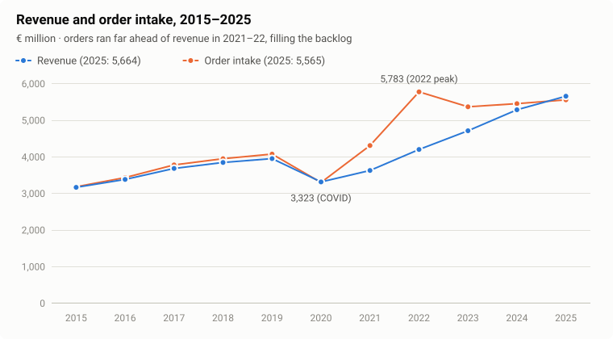
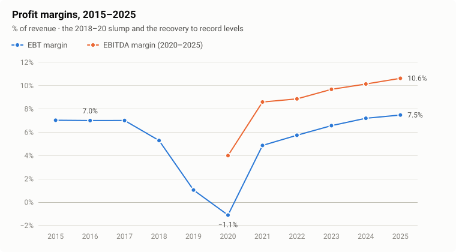
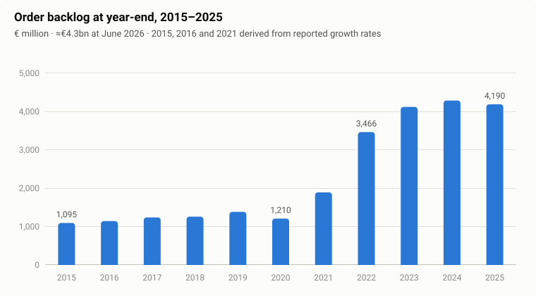
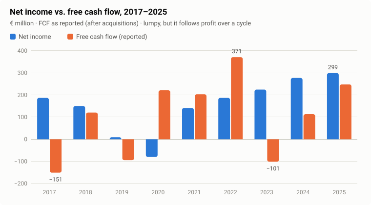
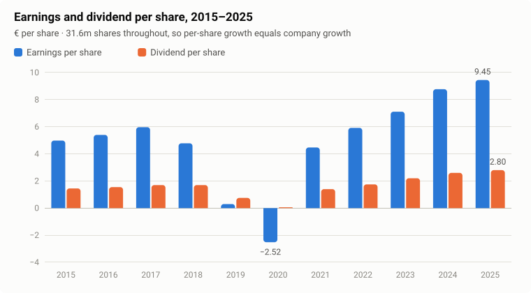

# Krones AG: a value analysis using Buffett's principles

**Krones AG** · Xetra: KRN (MDAX) · ISIN DE0006335003 · Neutraubling, Germany

**Report date:** 25 September 2026 · **Reference price:** ≈ €107 (Xetra, 24–25 Sep 2026) · **Market value:** ≈ €3.4bn (31,593,072 shares)

> **How this report works.** Krones is tested against Warren Buffett's principles and nothing else. The questions are: can the business be understood, does it have a durable competitive advantage, is management able, honest and owner-minded, are the economics good (returns on capital, owner earnings, little debt), and is the price sensible?
>
> There is **no valuation model** in this report: no DCF, no intrinsic-value estimate and no price target. Price is judged only with simple yardsticks (earnings yield against bonds, cash-flow yield and the stock's own multiple history). No other investor frameworks are used. Throughout, the report separates **what the market already believes** from **what the evidence actually says**.
>
> Research, not investment advice. All figures are in euros and are Krones' reported numbers unless marked *derived* or *my calculation*. [Appendix B](#appendix-b-data-notes-and-definitions) explains the data and its gaps.

**Contents**

1. [Summary and verdict](#1-summary-and-verdict)
2. [The business: what Krones actually does](#2-the-business-what-krones-actually-does)
3. [The industry: who buys bottling lines, and why](#3-the-industry-who-buys-bottling-lines-and-why)
4. [The moat: what protects Krones, and what does not](#4-the-moat-what-protects-krones-and-what-does-not)
5. [Ten years of operating history](#5-ten-years-of-operating-history)
6. [Economics: returns, owner earnings and the balance sheet](#6-economics-returns-owner-earnings-and-the-balance-sheet)
7. [Management and ownership](#7-management-and-ownership)
8. [The one-dollar test: did retained earnings create value?](#8-the-one-dollar-test-did-retained-earnings-create-value)
9. [Price: simple yardsticks, no model](#9-price-simple-yardsticks-no-model)
10. [Second-level thinking: what the price assumes and what the evidence says](#10-second-level-thinking-what-the-price-assumes-and-what-the-evidence-says)
11. [Risks: permanent loss versus temporary pain](#11-risks-permanent-loss-versus-temporary-pain)
12. [Verdict and what would change it](#12-verdict-and-what-would-change-it)
- [Appendix A: Data tables](#appendix-a-data-tables) · [Appendix B: Data notes](#appendix-b-data-notes-and-definitions) · [Appendix C: Sources](#appendix-c-sources)

---

## 1. Summary and verdict

**The thesis in one paragraph.** Krones is the world's largest maker of filling and packaging lines for beverages and liquid food. It is about three times the size of its nearest rivals, Sidel and KHS. It is a **good business, not a great one**. Its moat is real but narrow: scale, the broadest product range in the industry, a huge installed base that needs spare parts and service for decades, and a reputation that matters to customers, because a stopped line costs more than the price gap between machines. But margins are thin (7.5% before tax in 2025) and profits are cyclical: earnings per share fell from €5.97 in 2017 to a loss in 2020.

Since 2020 the business has been rebuilt:

- revenue up 70%
- EBITDA margin up from 4.0% to 10.6%
- return on capital employed up from 10% (2021) to 19%
- €0.4–0.5bn of net cash
- record earnings per share of €9.45 in 2025

The share price has gone the other way. It is down 26% from its February 2026 high to about €107, or roughly 11 times trailing earnings, a multiple usually reserved for companies in decline. **The market is pricing 2025 as a cyclical peak. The order book does not show one yet:** orders rose 4.5% in H1 2026 and the backlog is €4.3bn, about nine months of revenue. For a patient owner this is a sound, conservatively financed business at a price that demands little. The real risk is not the multiple; it is the earnings cycle.

### Snapshot

| Metric | Value | Source period |
|---|---|---|
| Revenue | €5,664m (+7.0%) | FY2025 |
| Order intake | €5,565m (+1.9%); H1 2026 €2,853m (+4.5%) | FY2025 / H1 2026 |
| Order backlog | ≈ €4.3bn (≈ 9 months of revenue) | 30 Jun 2026 |
| EBITDA / margin | €602m / 10.6% (H1 2026: 10.8%) | FY2025 |
| EBT / margin | €424m / 7.5% | FY2025 |
| Net income / EPS | €299m / €9.45 (record) | FY2025 |
| Free cash flow before M&A | €283m (H1 2026: −€31m) | FY2025 |
| ROCE | 19.1% (H1 2026: 17.7%) | FY2025 |
| Net cash (cash minus bank debt) | €405m (≈ €12.8 per share) | 30 Jun 2026 |
| Equity ratio | 42.2% | 31 Dec 2025 |
| Dividend | €2.80 (≈ 30% payout) | for FY2025 |
| P/E: trailing / 2026 consensus | ≈ 11.3x / ≈ 10.5x | at €107 |
| Earnings yield vs 10-year Bund | ≈ 8.8% vs ≈ 3.4% | Sep 2026 |
| 2026 guidance | Revenue +3–5% (FX-adjusted), EBITDA margin 10.7–11.1%, ROCE 19–20% | reaffirmed Jul 2026 |
| 2028 targets | Revenue ≈ €7bn, EBITDA margin 11–13%, ROCE > 20% | set Jul 2024 |

### Buffett's questions, answered briefly

| Buffett's question | Krones | Result |
|---|---|---|
| **Is the business understandable?** | Yes. It builds and services the machines that make, fill, label and pack bottles and cans. The *product* is simple; the *timing* of customers' capital spending is not. | Pass |
| **Does it have a durable competitive advantage?** | A narrow moat: scale, breadth, installed base, service network and reputation. Thin margins and cheaper Chinese rivals at the low end cap it. | Partial pass |
| **Is management able, candid and owner-minded?** | The founding family controls 51.9%. Financing is conservative, the payout has been about 30% for a decade and the share count has not changed since at least 2015. Execution failed in 2018–19. A new CEO took over in June 2026. | Pass, with a watch item |
| **Are the economics good?** | Today, yes: ROCE of 19%, owner earnings roughly equal to net income over a cycle, net cash. Across the whole cycle they are only average: the 2019–20 collapse is part of the record. | Pass now; mixed over the cycle |
| **Is the price sensible?** | About 11x earnings, an 8% free-cash-flow yield, about 5x EV/EBITDA and net cash. That is cheap against Krones' own history, against bonds and against listed peers. | Pass |

**Verdict: BUY for patient owners (3–5+ year horizon), sized as a cyclical business rather than a "forever" compounder.** Krones passes every Buffett test except the strictest one, a wide and unassailable moat. The most useful thing to watch is not the share price but **order intake**. [Section 12](#12-verdict-and-what-would-change-it) lists what would change this view.

---

## 2. The business: what Krones actually does

**Origin and control.** Hermann Kronseder founded Krones in 1951 in a 100 m² workshop in Neutraubling near Regensburg, Bavaria, building semi-automatic labelling machines, so the company turns 75 this year ([Krones history](https://www.krones.com/en/company/about-us/history-developmental-years.php); [packaging journal](https://packaging-journal.de/en/krones-celebrates-75-years-of-company-history/)). It is still controlled by his descendants. The **Kronseder Family Consortium GbR holds 51.9%** through a voting pool ([Krones FAQ](https://www.krones.com/en/company/investor-relations/faq.php)). Krones has about **21,400 employees** and reported revenue of **€5.66bn in 2025**.

**What it sells.** Krones calls itself a one-stop shop for producers of liquid consumer goods. Few if any rivals cover as much of a bottling plant's value chain:

| Step in the plant | Krones products (brands) |
|---|---|
| Making the container | PET preform injection moulding (**Netstal**, acquired 2024), stretch blow moulders |
| Making the product | Process technology: brewhouses, syrup rooms, filtration, UHT; valves and pumps (**Evoguard**, **Ampco Pumps**) |
| Filling | Fillers for PET, glass and cans, including aseptic lines; line concepts such as **Ingeniq** |
| Dressing and inspection | Labellers, inspection systems |
| Packing | Packers, palletisers, conveyors |
| Storing and shipping | Automated warehouses and material flow (**System Logistics**) |
| Closing the loop | PET recycling systems |
| After the sale | **Lifecycle Service (LCS)**: spare parts, upgrades, maintenance and digital services; used machines (**ecomac**); pharma container lines (**R+D Custom Automation**) |

**Three segments (FY2025)** ([Q4 2025 slides](https://www.investing.com/news/company-news/krones-q4-2025-presentation-slides-revenue-grows-7-but-eps-misses-forecasts-93CH-4514305)):

| Segment | Revenue 2025 | Share | Growth | EBITDA margin (2024 → 2025) |
|---|---|---|---|---|
| Filling and Packaging Technology | €4.77bn | ≈ 84% | +7.2% | 10.4% → 10.8% |
| Process Technology | €514m | ≈ 9% | +1.2% | 9.7% → 10.3% |
| Intralogistics | €376m | ≈ 7% | +13.3% | 7.0% → 8.4% |

**How the money is made.** There are two businesses inside Krones:

1. **Projects: new machines and lines.** Customers order a line, and Krones engineers, builds, installs and commissions it. Revenue follows orders with a lag; at the end of 2025 the backlog equalled about **nine months of revenue** (my calculation: €4,190m ÷ €5,664m). This part is lumpy and cyclical, and it depends on customers' capital budgets.
2. **Lifecycle Service: the installed base.** Every line runs for many years and needs spare parts, overhauls, format changes, upgrades and efficiency retrofits. Krones' stated goal is that, over the medium to long term, **three out of every four new machines and lines will be supported by its own service team** ([Annual Report 2025, strategy](https://www.krones.com/en/company/investor-relations/gb-2025-strategy-and-management-system.php)). Krones does not disclose the exact service share of revenue in any source this report could access. That gap matters, because service is the most valuable and most stable part of the business.

**Where the revenue comes from (2025).** Europe 30.1%; North and Central America 21.2%; Middle East and Africa 12.7%; the remaining ≈ 36% comes mostly from Asia-Pacific, China and South America (the full split was not available). The USA alone is **about 20% of revenue**, and roughly half of that is made locally.

**Customers.** Brewers, soft-drink bottlers, mineral-water, juice and dairy producers, and increasingly food, home-care and pharma companies. They range from global groups to regional champions; for example, Hell Energy runs two high-speed Krones can lines ([Krones reference](https://www.krones.com/en/company/press/magazine/reference/high-speed-to-the-power-of-two.php)).

**Circle of competence.** Buffett's first filter is whether an investor can understand the business well enough to judge its economics ten years out. Krones sells durable capital equipment plus aftermarket service into a consumer industry (beverages) that is itself very stable. The product and the business model are easy to understand. What is hard to predict is **when** customers spend. The analysis therefore has to focus on the cycle, not only on the franchise.

---

## 3. The industry: who buys bottling lines, and why

### Demand has a stable base and a cyclical top

People drink roughly the same amount every year, and packaged-beverage volumes grow slowly and steadily. **Machine demand is different: it is the capital spending of beverage companies, and that swings.** A brewer or bottler buys a line for one of five reasons:

- **Capacity:** new plants, above all in emerging markets. Krones cites population growth, urbanisation and a rising middle class as the long-run drivers ([Krones equity story](https://www.krones.com/en/company/investor-relations/equity-story.php)).
- **Packaging change:** cans instead of glass, returnable glass systems, lighter or recycled PET, new formats.
- **Efficiency and sustainability:** less energy, water, CO₂ and labour per litre; replacing old, inefficient lines.
- **Product mix:** functional drinks, aseptic dairy and plant-based drinks, premium segments.
- **Replacement** of worn-out equipment.

The 2021–22 boom was a mix of pent-up replacement after COVID-19 and packaging change. Orders jumped 34% in 2022 alone.

### The current backdrop is mixed

- **The German industry had a record 2025.** German food-processing and packaging machinery output rose 4.9% to almost €17bn, and packaging machines including beverage filling grew 8% to about €9bn. But **orders in Q1 2026 "did not meet expectations"**, with US tariffs, the war in Ukraine and the Middle East cited as reasons customers delay decisions ([packaging journal / VDMA](https://packaging-journal.de/verpackungsmaschinenbau-erreicht-rekordwert-2025/); [WPT / VDMA](https://processtechnology.wiley.com/de/nachrichten/vdma-produktion-von-nahrungsmittel-und-verpackungsmaschinen-2025-auf-rekordniveau)).
- **Food and beverage capex is tight.** US food and beverage companies spent 8.8% less than budgeted in 2025 and plan only +2.9% for 2026 ([Food Processing capex survey](https://www.foodprocessing.com/business-of-food-beverage/capital-spending/article/55362973/2026-capital-spending-outlook-tightening-the-belt)). At the same time the Coca-Cola system has lined up about $10bn of US infrastructure spending for 2026–2030 ([Finimize](https://finimize.com/content/coca-cola-lines-up-10-billion-for-us-infrastructure)).
- **Structural headwinds in developed markets.** GLP-1 weight-loss drugs reduce consumption of sugary drinks and high-volume alcohol such as beer. Global beverage-alcohol volume fell about 2% in 2025, and about 5% in the US ([FTI Consulting](https://www.fticonsulting.com/insights/articles/glp-1-drugs-rewriting-rules-food-beverage); [Dimins](https://www.dimins.com/blog/2026/04/21/glp-1-alcohol-consumption-beverage-alcohol-sales/)). Lower volume growth in rich countries means fewer capacity additions there, but not necessarily fewer format changes or efficiency upgrades.
- **Tariffs.** Management says about 20% of revenue is generated in the USA and about half of it is produced locally. That leaves roughly **10% of group revenue exposed to US import tariffs**. Krones is investing about €50m to expand US production and planned a new logistics centre in Franklin, Wisconsin, for early 2026 ([Krones AR 2025](https://www.krones.com/en/company/investor-relations/gb-2025-strategy-and-management-system.php); [Packaging World](https://www.packworld.com/rigid/filling-capping-closing/news/22956236/krones-inc-krones-to-open-north-american-logistics-center-expand-manufacturing); [wir magazin](https://www.wirmagazin.de/news/internationale-familienunternehmen/krones-und-die-zollpolitik-wie-familienunternehmen-ihre-stabilitaet-bewahren-152951)).

### Competitive structure: three full-line suppliers and a rising Chinese tier

| Competitor | Owner | Revenue | Notes |
|---|---|---|---|
| **Krones** | Listed; Kronseder family 51.9% | **€5.66bn** (2025) | Broadest range; ≈ 21,400 staff |
| **Sidel** | Tetra Laval (private) | ≈ €1.8bn (2025, +3%; services +7%) | Strong in PET; part of the Tetra Pak/DeLaval group ([Tetra Laval](https://www.tetralaval.com/annual-report/tetra-laval/comments-by-the-chairman-of-the-board)) |
| **KHS** | Salzgitter AG (steel group) | ≈ €1.65bn (2025); 5,769 staff | Salzgitter reportedly explored a sale at around €1bn ([Ruhr Nachrichten](https://www.ruhrnachrichten.de/dortmund/khs-gmbh-dortmund-wambel-getraenke-abfuellanlagen-salzgitter-milliarden-umsatz-w1016028-2001614171/); [Bloomberg](https://www.bloomberg.com/news/articles/2025-05-22/salzgitter-is-said-to-weigh-1-billion-sale-of-bottling-unit-khs)) |
| **Chinese suppliers** (e.g. Newamstar, Tech-Long) | Private / listed in China | n/a | Newamstar claims more than 3,000 lines in over 80 countries; increasingly competitive on price and quality ([trade listing](https://www.tompacks.com/new_detail/Top-10-Filling-Machine-Manufacturers-in-China-You-Should-Know.html)) |
| **Specialists** | Various | n/a | Single-machine or niche players (PET, aseptic, packaging, process) |

Krones is **≈ 3.1x Sidel and ≈ 3.4x KHS** by revenue (my calculation). German press estimates of its share of the global beverage-filling market range from **23% to 28%**, and the often-quoted claim is that **one in four bottles worldwide, and one in two in Europe, runs over a Krones line** ([WirtschaftsWoche](https://www.wiwo.de/unternehmen/industrie/weltmarktfuehrer-krones-fuellt-sie-alle-ab/8117706.html); [Fuchsbriefe](https://www.fuchsbriefe.de/vermoegen/aktien/krones-weltmarktfuehrer-bei-getraenkemaschinen); [Weltmarktführer-Index](https://www.weltmarktfuehrerindex.de/profil/krones)). These are estimates, not audited data.

**What the structure says.** The industry is a loose oligopoly at the top. The two Western rivals are divisions of conglomerates, and one of them (KHS) is reportedly for sale. That is usually a sign that sub-scale players struggle to earn good returns, which is good for the scale leader. The long-term threat comes from below: Chinese suppliers that are "good enough" and much cheaper, first in China and emerging markets, and later perhaps everywhere.

---

## 4. The moat: what protects Krones, and what does not

> **Buffett's principle:** the key to investing is determining the competitive advantage of a company and, above all, the *durability* of that advantage.

### What forms the moat

1. **Scale and breadth.** Few if any rivals can deliver, and take responsibility for, as much of a plant as Krones: from preform moulding (Netstal) through filling and packing to the automated warehouse. For a customer, one supplier means one point of responsibility for line efficiency, which is what they actually pay for. Scale also funds R&D, a global service network and local factories that smaller rivals cannot match.
2. **The installed base and service.** Each line that ships creates years of demand for spare parts, maintenance, format parts and upgrades, and the original manufacturer is the natural supplier. The independent analysis by [Silba Deepdives](https://silbadeepdives.substack.com/p/krn-krones-ag-family-control-zero) puts it well: the money is not only in selling machines but in capturing customers for about twenty years through service, spare parts, retrofits and upgrades.
3. **Reputation and risk aversion.** A high-speed line fills tens of thousands of containers an hour, so an hour of downtime can cost a bottler more than the price difference between suppliers. Buyers of mission-critical equipment are conservative, and that favours the proven leader.
4. **Engineering and intellectual property.** Krones holds more than 6,800 patents and utility models, runs innovation labs in Regensburg (since 2016) and Parma (since 2023), and management says it spends about 4–5% of revenue on R&D ([Krones AR 2025, innovation](https://www.krones.com/de/unternehmen/investor-relations/gb-2025-erfolgsfaktor-innovationen.php)).
5. **Local manufacturing.** Beyond Germany, Krones makes machines in Debrecen, Hungary (a €49m plant opened in 2019) and in Taicang, China, where a €200m new campus is being built. A plant in India is due to start in H2 2026, and US capacity is being expanded ([Packaging Gateway](https://www.packaging-gateway.com/projects/krones-production-plant/); [China Daily](http://jiangsu.chinadaily.com.cn/taicang/2025-02/14/c_1070722.htm); [Krones AR 2025](https://www.krones.com/en/company/investor-relations/gb-2025-strategy-and-management-system.php)). This lets Krones compete on cost where it must, and reduces tariff exposure.

### Evidence that the moat works

- **Pricing through inflation.** From 2021 to 2025, a period of steep increases in material and wage costs, the EBITDA margin rose every year: 8.1% before one-offs in 2021, then 8.9%, 9.7%, 10.1% and 10.6%. In 2025 the material-cost ratio fell to about 45% of revenue, helped by supplier agreements, pricing and product mix ([Silba Deepdives](https://silbadeepdives.substack.com/p/krn-krones-ag-family-control-zero)). Companies without pricing power do not expand margins while costs are rising.
- **Returns.** ROCE rose from 10.0% (2021) to 19.1% (2025), well above any reasonable cost of capital.
- **Customers pay up front.** Cash flow peaked in the strongest order years (2021–22), the pattern you would expect when orders come with down payments (see [section 6](#6-economics-returns-owner-earnings-and-the-balance-sheet)). Customers who pre-finance their supplier's production are a sign of a strong commercial position.
- **Relative scale.** Krones is three times the size of each full-line rival, and one of those rivals is reportedly for sale.

### Evidence that the moat is narrow

- **Thin margins.** An EBT margin of 7.5% and an EBITDA margin of 10.6% in a record year are modest. Businesses with wide moats usually earn much more. Every new line is tendered competitively, so switching costs protect the *service* stream far better than they protect the *next machine order*.
- **The margin collapsed once.** Between 2017 and 2020 the EBT margin went from 7.0% to −1.1% (§5). The 2019 fall happened while orders were still *growing*, so the cause was internal (costs and mix) rather than a collapse in demand.
- **Commoditisation from China.** The core argument in the [Silba Deepdives](https://silbadeepdives.substack.com/p/krn-krones-ag-family-control-zero) piece is that the performance gap has narrowed: customers can buy comparable throughput for materially less, and the technology edge that once justified a German premium has shrunk. So far the threat shows mostly in China and price-sensitive emerging markets.

### Moat verdict

**Narrow, but real, and roughly stable.** The strongest part of the moat is the installed base plus the service network. The weakest part is the price of a standard new line in an emerging market. The trend to watch is simple: **if Filling and Packaging Technology can hold an EBITDA margin above 10% while the market slows, the moat is doing its job.** If margins fall back toward 8% on flat volumes, it is being eroded.

---

## 5. Ten years of operating history

> **Buffett's principle:** look for a consistent operating history. The best returns usually come from companies doing much the same thing today as they were five or ten years ago.

<picture>
  <source media="(prefers-color-scheme: dark)" srcset="charts/revenue-orders-dark.svg">
  
</picture>

<picture>
  <source media="(prefers-color-scheme: dark)" srcset="charts/margins-dark.svg">
  
</picture>

| Year | Revenue €m | Orders €m | Backlog €m | EBT €m | EBT margin | Net income €m | EPS € | DPS € |
|---|---:|---:|---:|---:|---:|---:|---:|---:|
| 2015 | 3,174 | 3,189ᵈ | 1,095ᵈ | 223 | 7.0% | 156 | 4.98 | 1.45 |
| 2016 | 3,391 | 3,441 | 1,145ᵈ | 238ᵈ | 7.0% | 169 | 5.40 | 1.55 |
| 2017 | 3,691 | 3,787 | 1,240 | 259 | 7.0% | 187 | 5.97 | 1.70 |
| 2018 | 3,854 | 3,957ᵈ | 1,261 | 204 | 5.3% | 151 | 4.78 | 1.70 |
| 2019 | 3,959 | 4,084 | 1,386 | 42 | 1.1% | 9 | 0.30 | 0.75 |
| 2020 | 3,323 | 3,307 | ≈1,210 | −37 | −1.1% | −80 | −2.52 | 0.06 |
| 2021 | 3,635 | 4,316 | 1,893ᵈ | 177 | 4.9% | 141 | 4.47 | 1.40 |
| 2022 | 4,209 | 5,783 | 3,466 | 242 | 5.8% | 187 | 5.92 | 1.75 |
| 2023 | 4,721 | 5,377 | 4,122 | 311 | 6.6% | 225 | 7.11 | 2.20 |
| 2024 | 5,294 | 5,461 | 4,290 | 382 | 7.2% | 277 | 8.77 | 2.60 |
| 2025 | 5,664 | 5,565 | 4,190 | 424 | 7.5% | 299 | 9.45 | 2.80 |
| **CAGR 2015–25** | **+6.0%** | **+5.7%** | ×3.8 | **+6.6%** | | **+6.7%** | **+6.6%** | **+6.8%** |

ᵈ derived from reported growth rates (see [Appendix B](#appendix-b-data-notes-and-definitions)). Sources: Krones annual results releases 2015–2025 ([Appendix C](#appendix-c-sources)).

### Three chapters

**2015–2017: the steady years.** Revenue grew 6–9% a year, the EBT margin held at exactly 7.0% three years running, and EPS rose from €4.98 to €5.97. Krones was a dependable compounder, and it was priced like one (about 15x earnings in 2016, see §9).

**2018–2020: the breakdown.**
- **2018:** guidance was cut. Revenue growth was lowered from 6% to 4% and the EBT margin target from 7.0% to 6.5% ([Krones, 2018](https://www.krones.com/en/company/investor-relations/corporate-news-release-krones-reduces-revenue-and-earnings-forecast-for-2018.php)). EPS fell 20%.
- **2019:** in July the EBT-margin guidance was cut from about 6% to about 3%, citing high material costs and an unfavourable product mix, and the shares fell more than 10% ([Krones ad hoc, 2019](https://www.krones.com/en/company/investor-relations/ad-hoc-disclosure-krones-adjusts-its-earnings-outlook-for-2019.php); [inside.beer](https://www.inside.beer/news/detail/germany-black-day-for-krones.html)). Restructuring charges and impairments of about €70m followed, and the final EBT margin was 1.1%. **Orders rose 3.2% that year: the problem was internal.**
- **2020:** COVID-19 cut orders by 19% and revenue by 16%. Krones made a net loss of €80m, paid only the statutory minimum dividend of €0.06, and cut several hundred jobs in Germany ([Onetz](https://www.onetz.de/oberpfalz/neutraubling/wegen-corona-streicht-krones-500-stellen-deutschland-id3096272.html); [junge Welt](https://www.jungewelt.de/artikel/391828.neuer-stellenabbau-bei-krones-angek%C3%BCndigt.html)).

**2021–2025: the rebuild.** Orders jumped to records (2021 +31%, 2022 +34%), the backlog tripled to above €4bn, and revenue grew 12% in both 2023 and 2024. Margins rose every year. Management **raised guidance in 2021, 2022 and 2023** and met it in 2024 and 2025 (see §7). In 2025 Krones set records for revenue, EBITDA, net income and EPS.

<picture>
  <source media="(prefers-color-scheme: dark)" srcset="charts/backlog-dark.svg">
  
</picture>

### H1 2026: solid orders, soft profit and cash

| | H1 2025 | H1 2026 | Change |
|---|---:|---:|---:|
| Order intake | €2,730m | €2,853m | +4.5% (Q2: +3.5%) |
| Revenue | €2,727m | €2,715m | −0.4% reported; +1.8% FX-adjusted (≈ €60m FX drag) |
| EBITDA margin | 10.6% | 10.8% | +0.2 pp |
| EBT / margin | ≈ €206m / 7.5% | €198m / 7.3% | −3.8% |
| Net income / EPS | €146m / €4.60 | €139m / €4.39 | −4.6% EPS |
| FCF before M&A | +€47m | −€31m | working capital +€181m; capex 3.6% of revenue (2.5%) |
| Net cash (30 June) | €375m | €405m | |
| ROCE | 19.0% | 17.7% | |

Segment detail: **Process Technology** revenue −3.7% FX-adjusted to €243m, because turnkey projects were delayed; EBITDA margin 10.6%. **Intralogistics** revenue +9.7% FX-adjusted to €190m, but its margin fell to 5.3% (7.1%). Management said the Netstal acquisition "continued to weigh on group profitability", and that pricing and efficiency measures lifted the group EBITDA margin. The new CEO described global growth as slowing and uncertainty as elevated. The 2026 guidance was confirmed ([Krones H1 2026 release](https://www.krones.com/en/company/investor-relations/corporate-news-release-krones-further-increases-order-intake-and-profitability-in-first-half-of-2026.php); [H1 slides](https://www.investing.com/news/company-news/krones-h1-2026-slides-order-intake-rises-45-guidance-confirmed-93CH-4820061); [call highlights](https://finance.yahoo.com/markets/stocks/articles/krones-q2-earnings-call-highlights-130359107.html)).

**2026 is back-end loaded.** To reach +3–5% FX-adjusted revenue growth after +1.8% in H1, H2 needs roughly **+4% to +8%** (my calculation). The €4.3bn backlog makes that plausible. The earnings bar is higher: the consensus 2026 EPS of about €10.1–10.2 implies roughly **€5.75 in H2 against €4.85 in H2 2025, a ≈ 19% increase** (my calculation). That is a demanding second half, and it sets up the Q3 report on **6 November 2026**.

### Consistency verdict

Over **ten years**, Krones compounded revenue, EPS and dividends at 6–7% a year. **Year to year it is not consistent**: EPS fell 95% within two years (2017→2019) before turning into a loss. A Buffett-style business would not have a 2019 in its record. The rebuilt Krones of 2021–25 looks much better run, but it has not yet been through a real downturn.

---

## 6. Economics: returns, owner earnings and the balance sheet

> **Buffett's principles:** judge a business by its return on capital, not by earnings per share; look at *owner earnings*, not accounting profit; prefer high margins and little debt.

### Return on capital

| | 2021 | 2022 | 2023 | 2024 | 2025 | H1 2026 |
|---|---:|---:|---:|---:|---:|---:|
| ROCE (Krones definition) | 10.0% | 14.1% | 16.3% | 18.2% | 19.1% | 17.7% |
| EBITDA margin | 8.6%* | 8.9% | 9.7% | 10.1% | 10.6% | 10.8% |
| Working capital / revenue | 24.8% | 19.0% | 17.8% | 17.0% | n/a | n/a |
| Equity ratio | n/a | 38.3% | 38.3% | 40.5% | 42.2% | n/a |

\* 8.1% excluding one-off effects.

- **ROCE of about 19% is good**, and it has nearly doubled in four years. The 2028 target is above 20%.
- **Return on equity is about 14–15%** in 2025 (my calculation: €299m net income on €2.13bn year-end equity, or about 15% on average equity). It is held down by the cash pile. On the capital actually used in the operations, the return is closer to the ROCE.
- **The improvement is real, not financial engineering.** There is no meaningful bank debt, no buyback and no change in share count. The gains came from margins and from working capital falling from 24.8% to 17.0% of revenue.

### Owner earnings: does profit turn into cash?

<picture>
  <source media="(prefers-color-scheme: dark)" srcset="charts/cash-dark.svg">
  
</picture>

Buffett defines owner earnings as net income plus depreciation, minus the capex needed to maintain the business and any extra working capital. Krones does not report maintenance capex, so the honest proxy is **free cash flow before acquisitions**. That is a conservative choice, because it also deducts all *growth* capex.

| €m | 2022 | 2023 | 2024 | 2025 | 2022–25 total |
|---|---:|---:|---:|---:|---:|
| Net income | 187 | 225 | 277 | 299 | **988** |
| FCF before M&A | 398 | 13 | 293 | 283 | **987** |
| Acquisitions | 27 | 115 | 179 | 35 | 356 |
| FCF as reported | 371 | −101 | 113 | 248 | 631 |

**Over the four years, cash conversion was about 100%.** Owner earnings equal reported earnings. The earnings are real, but **they arrive unevenly**: in 2023 almost no cash came in, most likely because the down payments from the 2021–22 order boom had already been received and working capital built up as the backlog was delivered. Over 2018–2025, reported FCF (after €356m of acquisitions) was €1,082m against net income of €1,210m, or about 89%.

**Why the cash is lumpy: customer money.** As is usual for machinery makers, down payments on orders help fund production. When orders rise, cash floods in (2021–22). When orders flatten and the backlog is worked off, cash stalls (2023, H1 2026). **Part of Krones' net cash is customers' money, and it shrinks when the order cycle turns.** That is not a flaw, but it means the cash pile is not all "excess" capital.

### The balance sheet: a fortress, with one footnote

| | 2018 | 2019 | 2020 | 2021 | 2022 | 2023 | 2024 | 2025 | Jun 2026 |
|---|---:|---:|---:|---:|---:|---:|---:|---:|---:|
| Net cash €m (cash − bank debt) | 215 | 38 | 185 | 378 | 670 | 445 | 440 | 548 | 405 |

- **Bank debt is negligible**, the equity ratio is 42.2%, equity is €2.13bn on total assets of €5.04bn, and there are undrawn credit lines of about €0.9bn.
- **The footnote:** in 2019, a year of weak profit and working-capital build, net cash fell from €215m to €38m within twelve months. Krones never came close to financial distress, but the cash buffer is cyclical. It is protected by the absence of debt, not by a permanent cash hoard.
- **Not captured here:** lease liabilities and pension provisions were not available in the sources used. They would slightly reduce the net cash figure in an enterprise-value view.

### Margins and cost structure

In 2025, materials took about **45%** of revenue and personnel about **31%** (nine months). About **81% of the workforce is covered by collective wage agreements**, so German wage settlements flow straight into costs ([Silba Deepdives](https://silbadeepdives.substack.com/p/krn-krones-ag-family-control-zero)). With about 76% of revenue going to materials and staff, **small changes in price or volume move profit a lot**: operating leverage works both ways, which is exactly what 2019 and 2021–25 showed.

### Per share

<picture>
  <source media="(prefers-color-scheme: dark)" srcset="charts/per-share-dark.svg">
  
</picture>

The share count has been **31,593,072 throughout 2015–2025**: no dilution and no buybacks. Every euro of company growth reaches the shareholder one-for-one.

---

## 7. Management and ownership

> **Buffett's principles:** management should allocate capital rationally, be candid with shareholders, and resist the "institutional imperative", the urge to imitate peers and grow for growth's sake.

### Ownership and governance

- **Family control:** the Kronseder Family Consortium GbR holds 51.9% through a pooling agreement that bundles voting rights ([Krones FAQ](https://www.krones.com/en/company/investor-relations/faq.php)). Volker and Norman Kronseder have arranged to transfer their shares to their children ([Krones](https://www.krones.com/en/company/investor-relations/volker-and-norman-kronseder-arrange-transfer-of-krones-shares-to-their-children.php)). finanzen.net lists the Schadeberg family with about 5.8%, and institutions such as Swedbank Robur (≈ 2.9%), Allianz GI, Vanguard and Oddo BHF (≈ 1.3% each) ([finanzen.net](https://www.finanzen.net/unternehmensprofil/krones)).
- **Chairman:** Volker Kronseder, CEO until the end of 2015, has chaired the Supervisory Board since the June 2016 AGM, succeeding Ernst Baumann ([Krones](https://www.krones.com/en/company/press/agm-of-krones-ag-farewells-long-serving-supervisory-board-chairman-ernst-baumann.php); [Handelsblatt](https://www.handelsblatt.com/unternehmen/management/volker-kronseder-tritt-amt-ab-christoph-klenk-wird-krones-chef/11523588.html); [Sachon](https://www.sachon.de/en/brewing-and-beverage-industry-international/news-archive/news/detail/krones:-volker-kronseder-neuer-aufsichtsratsvorsitzender.html)).
- **What family control means for a minority owner.** On the plus side: long horizons, conservative financing, and a controlling owner who is paid in the same dividends and share price as everyone else. On the minus side: outside shareholders have no say, takeovers are effectively impossible (so there is no takeover premium), and the next generation's attitudes matter.

### Leadership change in 2026

- **Christoph Klenk** was CEO from January 2016 and **stepped down early on 10 June 2026**, after the AGM. His contract ran to the end of 2026, and the company described the change as long-term succession planning.
- **Thomas Ricker** became CEO on **11 June 2026**. He has been on the Executive Board since 2012, most recently as Chief Sales Officer.
- **From 1 July 2026** the Executive Board has five areas organised around markets and technology, explicitly aimed at the 2028 targets. Ricker is CEO. **Uta Anders** is CFO and also covers HR and sustainability. **Markus Tischer** is CTO, covering technology, digital, and machines and lines. The new members are **Bülent Bayraktar** (Process and System Solutions: process technology, intralogistics, moulding (Netstal) and recycling) and **Reinhold Jung** (International Operations and Services, the whole global service organisation) ([Krones press release](https://www.krones.com/en/company/press/the-supervisory-board-of-krones-group-has-appointed-thomas-ricker-as-the-new-chairman-of-the-executive-board.php); [PETplanet](https://petpla.net/2026/03/20/krones-reorganises-executive-board/); [Krones Executive Board](https://www.krones.com/en/company/about-us/executive-board.php)).

**Assessment:** this is continuity, not a break. The new CEO is a 14-year insider and the family chairman stays. The structural change worth noting is that **service now has its own board member**, which fits the moat analysis in §4.

### Capital allocation record

| Use of capital | What Krones did | Judgement |
|---|---|---|
| **Dividends** | Payout ≈ 30% of net income in every normal year (29.6% for 2022, 2024 and 2025; 35.6% in 2018, when the dividend was held flat). Cut to €0.75 for 2019 and €0.06 for 2020, then rebuilt to €2.80. | Rational: it flexes with earnings and does not strain the balance sheet |
| **Share count** | Unchanged at 31.59m throughout 2015–2025 | Good: no dilution. But no buybacks either, even at low prices |
| **Acquisitions** | Small and mid-sized bolt-ons: System Logistics (60%, 2016), Javlyn (2017), R+D Custom Automation (80.5%, 2022; pharma), Ampco Pumps (90%, 2023; ≈ $50m revenue, high margin), **Netstal (100%, 2024; €170m; > €200m revenue)** | Disciplined in size. Netstal is the test case: margins below the group and still a drag in 2026 |
| **Organic investment** | Plants in Hungary, China (Taicang) and India; US expansion (≈ €50m); capex ≈ 2.5–3.6% of revenue | Sensible: local-for-local production against tariffs and low-cost competition |
| **Retained cash** | Net cash of €0.4–0.7bn held since 2021 | Conservative. Arguably too much for a family-controlled company, but it is partly customers' money (§6) |

Deal sources: [System Logistics](https://www.krones.com/en/company/press/krones-purchase-of-system-logistics-stake-closed-successfully.php) · [Javlyn](https://www.businesswire.com/news/home/20170525005860/en/Krones-Strengthens-Process-Technology-Footprint-U.S.-Acquisition) · [R+D](https://www.krones.com/en/company/investor-relations/corporate-news-release-krones-expands-its-capabilities-in-the-growing-pharmaceutical-market.php) · [Ampco](https://www.beveragedaily.com/Article/2023/04/24/Krones-acquires-Ampco-Pumps/) · [Netstal](https://www.krones.com/en/company/investor-relations/corporate-news-release-krones-successfully-completes-acquisition-of-injection-molding-technology-company-netstal.php), [Plastics News](https://www.plasticsnews.com/mergers-acquisitions/krones-acquiring-netstal-cash-strapped-kraussmaffei-183m).

### Candour and track record

- **Bad news was published promptly.** The 2018 and 2019 guidance cuts were issued as ad hoc disclosures, and the 2019 restructuring was named and quantified. That is candid.
- **After the reset, delivery was reliable.** Guidance was raised in 2021, 2022 and 2023 ([2021](https://www.krones.com/en/company/investor-relations/ad-hoc-disclosure-krones-raises-full-year-guidance-for-2021-and-publishes-preliminary-half-year-figures.php), [2022](https://www.eqs-news.com/news/ad-hoc/krones-ag-krones-erhoeht-prognose-fuer-das-umsatzwachstum-2022/980aaaec-b1a2-4e34-bc4e-885327e02709_en), [2023](https://www.eqs-news.com/news/ad-hoc/krones-ag-krones-erhoht-die-prognose-fur-das-umsatzwachstum-fur-das-gesamtjahr-2023/2a4a975d-012f-4ac6-b1c3-e56dd878e761_en)). The 2024 and 2025 targets were met: 2025 guidance was revenue +7–9%, EBITDA margin 10.2–10.8% and ROCE 18–20%, against actuals of +7.0%, 10.6% and 19.1%.
- **One recent blemish:** Q4 2025 EPS of about €2.70 missed the roughly €3.26 consensus, and the shares fell about 6% on the day ([Investing.com](https://www.investing.com/news/transcripts/earnings-call-transcript-krones-ag-q4-2025-earnings-miss-forecast-93CH-4514142)).
- **Pay is moderate:** the maximum total compensation is capped at €2.5m for the CEO and €2.2m for other board members ([compensation system](https://www.moneycontroller.de/finanznachrichten/krones-ag/vergutungssystem-des-vorstands-98550)). That is modest for a €5.7bn-revenue group.

### The institutional-imperative risk

The **€7bn revenue target for 2028** is the one element that worries me from a Buffett perspective. From €5.66bn in 2025 it needs about 7.3% a year. With 2026 guided at +3–5%, **2027–28 would need roughly 8.5–9.5% a year** (my calculation), well above the organic trend. A target like that can tempt management to **buy revenue**. The best protection is the family owner's long history of modest, digestible deals. The first test is how Netstal is fixed. The second is whether the next acquisition is sized for the business or for the target.

### People

About 21,400 employees. There are strong collective-bargaining structures (IG Metall; 81% under collective agreements), and a painful but negotiated round of job cuts in 2019–20. Employee-review data (Glassdoor or kununu scores) could not be verified for this report.

---

## 8. The one-dollar test: did retained earnings create value?

> **Buffett's principle:** a company should create at least one dollar of market value for every dollar of earnings it retains.

**Period:** September 2016 to September 2026 (fiscal years 2016–2025). All figures are per share; this is my calculation from reported EPS, dividends and quoted share prices ([finanzen.ch](https://www.finanzen.ch/nachrichten/aktien/mdax-papier-krones-aktie-so-viel-gewinn-haette-ein-krones-investment-von-vor-10-jahren-eingefahren-1036556050)).

| | Value |
|---|---:|
| Sum of EPS, FY2016–FY2025 | €49.65 |
| Sum of dividends for FY2016–FY2025 | €16.51 |
| **Retained earnings per share** | **€33.14** (≈ €1.05bn in total) |
| Share price, Sep 2016 → Sep 2026 | €81.00 → ≈ €107 (**+€26**) |
| **Market value created per €1 retained (at €107)** | **≈ €0.78** |
| Same test at the Feb 2026 high (€144.20) | ≈ €1.91 |
| EPS, FY2016 → FY2025 | €5.40 → €9.45 (**+€4.05**) |
| **Extra annual earnings per €1 retained** | **≈ 12 cents**, while also building net cash |
| Total shareholder return, Sep 2016 → Sep 2026 | ≈ +52% (≈ 4.3% a year, dividends not reinvested) |

**What this says.**

- **The business passed the test.** Every euro kept in the business since 2016 earns about 12 cents a year after tax, and part of the retained money now sits in the bank as net cash.
- **The stock failed it at today's price.** Earnings per share rose 75% and the dividend 81%, but the share price rose only 32%, because the market multiple fell from about 15x to about 11x.
- **The result depends entirely on the date.** At the February 2026 high the same test shows almost €2 of value per euro retained. Buffett intended the test for long periods precisely because market prices swing around value.

**Conclusion:** over ten years **management compounded the business at about 6–7% a year, and the market paid less and less for it.** For a new buyer that gap is the opportunity. For a long-standing holder it has been the frustration.

---

## 9. Price: simple yardsticks, no model

> **Buffett's principle:** price is what you pay, value is what you get. Compare what a business earns on its price with what a government bond pays.

This section deliberately does **not** estimate an intrinsic value. It only shows what the current price buys.

### What €107 buys

| Yardstick | At ≈ €107 | How to read it |
|---|---:|---|
| P/E on FY2025 EPS (€9.45) | **11.3x** | Low for a market leader with ROCE of 19% |
| P/E on trailing 12 months (EPS €9.24) | 11.6x | H1 2026 EPS was below H1 2025 |
| P/E on 2026 consensus (≈ €10.1–10.2) | ≈ 10.5x | Only if the strong H2 arrives (§5) |
| P/E excluding net cash (€12.8 per share) | ≈ 10.0x | The operating business alone |
| **Earnings yield** (FY2025) | **≈ 8.8%** | **≈ 2.5x the 10-year Bund (≈ 3.4%)** ([Trading Economics](https://de.tradingeconomics.com/germany/government-bond-yield), [Cbonds](https://cbonds.de/10-year-german-government-bond-yield/)) |
| FCF yield (2025 FCF before M&A, €283m) | ≈ 8.4% | 2022–25 average: ≈ 7.3% |
| Dividend yield (€2.80) | ≈ 2.6% | About 30% payout; the rest is reinvested |
| EV/EBITDA (EV ≈ €2.98bn; EBITDA €602m) | ≈ 4.9x | EV uses June 2026 net cash and excludes leases and pensions |
| Price/book (equity €2.13bn) | ≈ 1.6x | |

### Against its own history

| Date | Share price | EPS basis | P/E |
|---|---:|---:|---:|
| Sep 2016 | €81.00 | FY2016: €5.40 | ≈ 15.0x |
| Jul 2021 | ≈ €80 | FY2021: €4.47 | ≈ 18.0x (earnings still recovering) |
| May 2025 (all-time high) | €145.60 | FY2025: €9.45 | ≈ 15.4x |
| Feb 2026 (52-week high) | €144.20 | FY2025: €9.45 | ≈ 15.3x |
| **Sep 2026** | **≈ €107** | FY2025: €9.45 | **≈ 11.3x** |

Price data: [finanzen.ch 10-year](https://www.finanzen.ch/nachrichten/aktien/mdax-papier-krones-aktie-so-viel-gewinn-haette-ein-krones-investment-von-vor-10-jahren-eingefahren-1036556050), [finanzen.at 5-year](https://www.finanzen.at/nachrichten/aktien/mdax-titel-krones-aktie-so-viel-gewinn-hatte-ein-krones-investment-von-vor-5-jahren-abgeworfen-1036335872), [boerse.de](https://www.boerse.de/aktien/Krones-Aktie/DE0006335003), [ad-hoc-news (52-week range)](https://www.ad-hoc-news.de/boerse/news/corporate-news/krones-stock-gains-1-3-percent-near-its-yearly-low/70157304), [finanzen.ch (Sep 2026 trading)](https://www.finanzen.ch/nachrichten/aktien/krones-aktie-kursbewegung-24-09-2026-1035064647).

**Against peers**, as context only because the business mixes differ: GEA traded at about 24x trailing earnings in spring 2026 and Alfa Laval at about 21x 2026 earnings ([stockanalysis GEA](https://stockanalysis.com/quote/etr/G1A/); [MarketScreener Alfa Laval](https://www.marketscreener.com/quote/stock/ALFA-LAVAL-AB-6494532/)). Both have higher service shares and margins, which justifies part of the gap, but not a halving of the multiple.

### The bond comparison, in plain words

At €107 an owner "earns" about **8.8 cents a year per euro invested**. About 2.6 cents come back as dividends and the rest is reinvested in a business returning about 19% on capital. A 10-year German government bond pays about 3.4 cents, fixed. **Krones is cheap if 2025's earnings are roughly repeatable, and it is not cheap if they are a cyclical peak.** The whole investment case therefore rests on the question in the next section.

### Where the analysts stand

In May 2026 every covering analyst rated Krones a Buy, with an average target of about €180 when the stock was at €118 ([finanzen.ch](https://www.finanzen.ch/nachrichten/aktien/analysten-sehen-fuer-krones-aktie-luft-nach-oben-1036210016)). Warburg set €187 and Jefferies €165, and Berenberg, Deutsche Bank and DZ Bank all said Buy in the summer. In September **Bernstein started coverage at Market-Perform with a €111 target**, questioning the 2028 revenue goal and signalling caution on 2027 ([ad-hoc-news](https://www.ad-hoc-news.de/boerse/news/corporate-news/krones-stock-falls-as-bernstein-sets-a-eur-111-target/70167672); [ad-hoc-news](https://www.ad-hoc-news.de/boerse/news/unternehmensnachrichten/bernstein-cuts-krones-to-neutral-questioning-the-packaging-giant-s-2028/70168566); [Finanztrends](https://www.finanztrends.de/news/krones-aktie-neues-kursziel/)).

---

## 10. Second-level thinking: what the price assumes and what the evidence says

First-level thinking says "great company, buy it" or "growth is slowing, sell it". Second-level thinking asks **what is already in the price, and where the consensus could be wrong**. At about 11x earnings, the price already assumes a lot of bad news.

### The one question that decides this investment

> **Is 2025 a cyclical peak in Krones' earnings, or a new base?**

The market's answer, judging by the multiple compression from about 15x to about 11x in seven months, is *peak*. The evidence is split.

| Evidence for "peak" (the market's view) | Evidence for "new base" |
|---|---|
| Book-to-bill has been about 1.0 since 2024 (2025: 0.98), and the backlog shrank 2% in 2025 | Orders are still **growing**: +8.6% in Q4 2025, +5.3% in Q1 2026 and +3.5% in Q2 2026 (my calculation for Q1) |
| Revenue growth is slowing from 12% to 7% to the 3–5% guided for 2026 | The backlog of €4.3bn, about 9 months of revenue, is twice the pre-COVID coverage (about 4 months in 2019) |
| H1 2026 EPS was down 4.6%, FCF negative and ROCE lower | Margins keep rising (H1 EBITDA margin 10.8%) on pricing and efficiency |
| Industry orders were weak in Q1 2026 (VDMA), and beverage capex budgets are tight | Emerging-market capacity, packaging change and efficiency upgrades continue; the Coca-Cola system alone plans $10bn of US spending |
| GLP-1 and falling alcohol volumes in developed markets | Machine demand follows capex and format changes more than litres sold |
| Netstal and Intralogistics margins are under pressure | Service is a growing, stickier share of the business; the new board structure gives it its own owner |

**My reading:** the order data does not yet show a downturn. In the one real demand shock of the past decade, 2020, the signal was unmistakable in orders (−19%). **Orders are the variable to watch, not margins or the share price.**

### Six debates, first level against second level

| Debate | First-level view (what the price reflects) | Second-level view (what the evidence says) | What settles it |
|---|---|---|---|
| **1. "Earnings have peaked."** | Record margins, slowing growth: a classic top, so pay only 11x. | Orders are still rising and the backlog is large. The last margin collapse (2019) was *internal* (costs and mix) while orders grew; today margins are *rising* through cost inflation. | Q3 orders on 6 Nov 2026; FY2026 book-to-bill |
| **2. "The €7bn 2028 target is unrealistic."** | Credibility is damaged, so derate the stock. | Probably true organically: it needs about 8.5–9.5% a year in 2027–28. **But owners are paid in per-share earnings, not revenue.** The real risk is management **buying** revenue to hit a number. | Size and price of the next acquisition; any change to the target |
| **3. "Net cash makes it safe."** | Fortress balance sheet, so downside is limited. | Safe from bankruptcy, yes: no meaningful bank debt and a 42% equity ratio. But **part of the cash is customers' down payments**, and cash shrinks when orders slow or working capital builds (2019: €215m to €38m; 2023: FCF before M&A only €13m). The cash is cyclical; the absence of debt is what protects owners. | FY2026 FCF before M&A; working capital to revenue |
| **4. "China will commoditise bottling lines."** | Good-enough Chinese machines will crush margins. | Real at the low end and in emerging markets. But Krones' margins rose through 2021–25, and multinational bottlers buy uptime, service coverage and total cost of ownership. Krones is localising production (Taicang, India, Hungary) to compete on cost. | Filling and Packaging margin above 10%; Asian order trend; price-war language on calls |
| **5. "Negative H1 cash flow is a red flag."** | Cash quality is deteriorating. | Management attributes it largely to deliberate choices: inventory for local-for-local US production (tariffs) and capex raised to 3.6% of revenue for new capacity. It must reverse in H2, and if it does not, the bears are right. | H2 2026 FCF; year-end net cash compared with €548m |
| **6. "The CEO change adds risk."** | New leadership brings uncertainty. | Continuity: a 14-year board insider and an unchanged family chairman. The larger risk is not the person but the **incentive** to deliver a revenue target. | Strategy and capital-allocation statements through 2027 |

### A subtle point about the backlog

A backlog of nine months looks like safety, and it is. But part of the jump from about four months (2019) to nine months (2025) most likely reflects **longer delivery times** after the 2021–23 supply-chain disruption (my inference; Krones does not split this out). If lead times normalise, the backlog can shrink **without any fall in demand**, and a shrinking backlog headline could scare the market even while the business is healthy. It works the other way too: a shrinking backlog can hide a real slowdown for a few quarters. **Order intake per quarter is the cleaner signal.**

### Consensus is not the market

The most instructive fact of 2026: in May, **every** covering analyst said Buy, with an average target of about €180. The shares then fell to about €106–107. The sell-side consensus was not the market's view; the price was. Today the most cautious broker (Bernstein, €111) sits close to the price, while the targets published earlier in the year (€165–187) are 50–75% above it. **If the fundamentals disappoint, the risk is a wave of estimate and target cuts,** because consensus 2026 EPS requires a H2 about 19% above last year's (§5). **If they hold, the stock does not need analysts to be right. It only needs earnings not to fall.**

### The asymmetry, without a model

- **What has to go right:** little. At about 11x earnings with net cash, the price does not require growth, margin gains or the 2028 target. It requires earnings to stay roughly where they are.
- **What can go wrong:** earnings, not the multiple. The history shows that in a bad year Krones' EPS can fall 90% or more (2019) even without a demand collapse. **The downside lies in a repeat of 2018–20, and the protection lies in the family's conservatism, the balance sheet and the service base.**

---

## 11. Risks: permanent loss versus temporary pain

> **Buffett's principle:** rule No. 1 is never lose money. Separate risks that can permanently impair value from those that only move the share price.

### Risks that could permanently destroy value

| Risk | Why it matters | Early warning signs |
|---|---|---|
| **1. Commoditisation by Chinese OEMs** | Lower prices on new lines, and every lost line is also a lost stream of future service | FPT EBITDA margin trending below 10%; lost tenders at multinational customers; "price pressure" on earnings calls |
| **2. A structural decline in customers' volumes** | GLP-1, falling alcohol consumption and regulation could shrink capacity needs in developed markets for good | Orders from European and North American brewers; replacement cycles lengthening |
| **3. Capital misallocation** | A large, expensive acquisition to chase the €7bn target; Netstal not fixed | A deal above ≈ €500m at a high multiple; net cash turning into net debt; continued Netstal drag |
| **4. Governance and succession** | Majority control means minority owners depend on the family's judgement across the generational transfer | Changes to the voting pool; related-party dealings; a dividend-policy shift |
| **5. Execution and costs** | 2018–19 showed how material costs, mix and project overruns can wipe out profit; wages are heavily unionised | Guidance cuts citing costs; the material-cost ratio rising again |

### Risks that mainly cause temporary pain

- **A beverage capex pause**, the cycle Bernstein highlights: fewer orders for a few quarters.
- **US tariffs:** about 10% of revenue is exposed, and mitigation through local production costs working capital and capex.
- **Currency:** FX cost about €60m of revenue in H1 2026.
- **Working-capital swings:** FCF can be near zero or negative in a given year (2017, 2019, 2023, H1 2026).
- **Weaker segments:** Intralogistics and Process Technology margins.
- **Geopolitics:** Middle East and Africa are about 12.7% of revenue, and the war in Ukraine and Middle East tensions are delaying customers' investment decisions (VDMA).
- **The leadership transition in 2026.**

---

## 12. Verdict and what would change it

### Verdict

| Buffett's test | Result |
|---|---|
| Understandable business | ✅ Yes |
| Durable competitive advantage | ◐ Narrow but real (scale, breadth, installed base, service, reputation) |
| Able, candid, owner-oriented management | ✅ Yes, with the 2018–19 execution lapse and the 2028 revenue target as caveats |
| Good economics (returns, owner earnings, debt) | ✅ ROCE of 19%, cash conversion of about 100% over 2022–25, no meaningful bank debt, but cyclical |
| Sensible price | ✅ About 11x earnings, an 8–9% earnings yield (about 2.5x the Bund), about 5x EV/EBITDA |

**BUY for patient owners with a 3–5+ year horizon. Accumulate gradually rather than all at once, and size the position as a cyclical business.**

Krones is not a Buffett "wonderful business at a fair price". Its moat is too narrow and its history too cyclical for that. It is a **good business at a cheap-looking price**. It is the global leader, run by an owner-family that finances conservatively, and it has rebuilt its profitability since 2020. The price already discounts a cyclical downturn that the order book does not yet show. If earnings merely hold, the owner earns an 8–9% earnings yield. If the cycle turns, the balance sheet and the service base protect against permanent loss, though not against a painful drawdown.

### What would change the view

**Turn negative (review or sell) if:**

1. Order intake falls year-on-year for **two consecutive quarters** and book-to-bill drops **below about 0.95**.
2. The FPT EBITDA margin falls **below 10%**, or 2026 guidance is cut, particularly if Chinese competition is named as the cause.
3. **FY2026 FCF before M&A comes in below about €150m** (H1 2026 was −€31m), which would signal a working-capital or pricing problem rather than timing.
4. A **large acquisition** (above about €500m, or anything that turns net cash into net debt) is made to reach the 2028 revenue target.
5. The family voting pool changes, or governance and dividend policy deteriorate.

**Become more positive if:**

1. Q3 and Q4 2026 orders keep growing and book-to-bill stays **at or above 1.0**.
2. The EBITDA margin moves toward **11% or more** and Netstal visibly improves.
3. H2 2026 free cash flow recovers, taking year-end net cash back toward €0.5bn.
4. Krones starts **disclosing its service share** and growth. This is the moat's most important evidence and currently the biggest data gap.
5. Management signals that the 2028 revenue target will not be chased at any price.

### Dates to watch

- **6 November 2026:** Q3 2026 quarterly statement and call ([Krones financial calendar](https://www.krones.com/en/company/investor-relations/financial-calendar.php))
- **Early 2027:** preliminary FY2026 figures and 2027 guidance

---

## Appendix A: Data tables

### A1. Annual data 2015–2025 (€ million unless stated)

| Year | Revenue | Orders | Backlog | EBITDA | EBT | Net income | EPS € | DPS € | FCF reported | FCF before M&A | Net cash | ROCE |
|---|---:|---:|---:|---:|---:|---:|---:|---:|---:|---:|---:|---:|
| 2015 | 3,173.5 | 3,189ᵈ | 1,095ᵈ | n/a | 223.3 | 156.3 | 4.98 | 1.45 | n/a | n/a | n/a | n/a |
| 2016 | 3,391.3 | 3,441.3 | 1,145ᵈ | n/a | 237.8ᵈ | 169.1 | 5.40 | 1.55 | n/a | n/a | n/a | n/a |
| 2017 | 3,691.4 | 3,786.8 | 1,240.1 | n/a | 259.0 | 187.1 | 5.97 | 1.70 | −150.7 | n/a | n/a | n/a |
| 2018 | 3,854.0 | 3,957ᵈ | 1,261.1 | n/a | 204.3 | 150.6 | 4.78 | 1.70 | 120.7 | n/a | 215.1 | n/a |
| 2019 | 3,958.9 | 4,083.5 | 1,385.7 | n/a | 41.7 | 9.2 | 0.30 | 0.75 | −94.4 | n/a | 38.1 | n/a |
| 2020 | 3,322.7 | 3,307.1 | ≈1,210 | 133.2 | −36.6 | −79.7 | −2.52 | 0.06 | 221.3 | n/a | 184.9 | n/a |
| 2021 | 3,634.5 | 4,316.2 | 1,893ᵈ | 312.6 | 177.3 | 141.4 | 4.47 | 1.40 | 203.3 | n/a | 378.3 | 10.0% |
| 2022 | 4,209.3 | 5,782.8 | 3,466.4 | 373.3 | 242.1 | 187.1 | 5.92 | 1.75 | 371.0 | 398.2 | 669.5 | 14.1% |
| 2023 | 4,720.7 | 5,376.6 | 4,122.3 | 457.3 | 310.5 | 224.6 | 7.11 | 2.20 | −101.3 | 13.2 | 444.7 | 16.3% |
| 2024 | 5,293.6 | 5,460.7 | 4,289.5 | 537.1 | 381.6 | 277.2 | 8.77 | 2.60 | 113.2 | 292.5 | 439.9 | 18.2% |
| 2025 | 5,663.8 | 5,564.7 | 4,190.4 | 602.3 | 424.1 | 299.2 | 9.45 | 2.80 | 247.7 | 282.9 | 548.2 | 19.1% |

ᵈ derived (see Appendix B). Machine-readable version: [`data/krones_financials_2015_2025.csv`](data/krones_financials_2015_2025.csv).

**Consistency check (my calculation):** opening backlog + orders − revenue reproduces the reported closing backlog to within €0.1m in every year where both ends are reported (2019, 2023, 2024, 2025). The gaps in 2018 (−€82m) and 2020 (−€160m) most likely reflect accounting and FX effects (IFRS 15 was adopted in 2018; FX and cancellations in 2020).

### A2. Other data points used

| Item | Value | Source |
|---|---|---|
| EPS 2013 / 2014 | €3.84 / €4.30 | [Krones 2014 results](https://www.krones.com/de/unternehmen/investor-relations/corporate-news-meldung-krones-hat-die-fuer-2014-gesetzten-ziele-erreicht-und-gibt-positiven-ausblick-fuer-2015.php) |
| Employees 2018 / 2025 | 16,545 / ≈ 21,400 | [Krones 2018 highlights](https://www.krones.com/en/company/investor-relations/gb-2018-highlights.php); [stockanalysis](https://stockanalysis.com/quote/etr/KRN/employees/) |
| Equity / total assets (Dec 2025) | €2.13bn / €5.04bn | [finanzen.net](https://www.finanzen.net/bilanz_guv/krones) |
| Undrawn credit lines | ≈ €0.9bn | FY2025 reporting via [stockanalysis](https://stockanalysis.com/quote/etr/KRN/statistics/) |
| Consensus EPS 2026 | ≈ €10.1–10.2 | [finanzen.ch](https://www.finanzen.ch/nachrichten/aktien/krones-aktie-kursbewegung-22-09-2026-1035061939) |
| Q4 2025 orders / EBITDA margin | €1.46bn (+8.6%) / 11.0% | [Investing.com](https://www.investing.com/news/transcripts/earnings-call-transcript-krones-ag-q4-2025-earnings-miss-forecast-93CH-4514142) |
| Shares outstanding | 31,593,072 | [Krones FAQ](https://www.krones.com/en/company/investor-relations/faq.php) |

---

## Appendix B: Data notes and definitions

- **Access limits.** Krones' own website was not reachable from the environment used to write this report. The figures come from Krones' corporate news releases and reports as published or mirrored (EQS, company press pages and financial media) and were located through web search. Every number was cross-checked where two sources existed; the backlog identity in Appendix A1 is an internal check.
- **Derived values (ᵈ):**
  - 2015 orders: from the +7.9% growth reported for 2016.
  - 2015 and 2016 backlog: from the growth rates reported for 2016 and 2017 (≈ €1.09bn and ≈ €1.14bn reported).
  - 2016 EBT: from the +8.9% EBT growth reported for 2017.
  - 2018 orders: from the +3.2% growth reported for 2019 (≈ €3.96bn reported).
  - 2021 backlog: from the +83.1% growth reported for 2022.
- **Net cash** is Krones' definition: cash and cash equivalents minus bank debt. It excludes lease liabilities and pension provisions, which were not available here.
- **Free cash flow** is shown as reported by Krones (after acquisitions) and, from 2022, also *before M&A* as disclosed by Krones.
- **ROCE** is Krones' definition (EBIT relative to average capital employed). **EBITDA 2021** includes one-off effects (8.6% reported; 8.1% excluding them).
- **Reference price** of ≈ €107: Krones traded between about €106.80 and €111.80 on Xetra from 22 to 25 September 2026. All yardsticks in §9 use €107.
- **My calculations:** growth rates, ratios, the one-dollar test, H2 requirements and the 2028 math. Consensus figures are third-party estimates and change often.
- **Not verified or not available:** the exact service share of revenue, the full regional split, lease and pension liabilities, maintenance capex, and employee-satisfaction data.

---

## Appendix C: Sources

**Krones: results and reports**
- FY2025: [results](https://www.krones.com/en/company/investor-relations/cn-krones-continued-profitable-growth-path-in-2025.php) · [annual report and dividend](https://www.krones.com/en/company/investor-relations/corporate-news-release-krones-continues-profitable-growth-path-and-increases-dividend-per-share.php) · [AGM dividend €2.80](https://www.krones.com/en/company/investor-relations/annual-general-meeting-of-krones-ag-approves-dividend-of-2_80-euros-per-share.php) · [strategy and management system](https://www.krones.com/en/company/investor-relations/gb-2025-strategy-and-management-system.php) · [innovation](https://www.krones.com/de/unternehmen/investor-relations/gb-2025-erfolgsfaktor-innovationen.php)
- 2026: [Q1](https://www.krones.com/en/company/investor-relations/corporate-news-release-krones-starts-financial-year-with-strong-order-intake-and-confirms-financial-targets-for-2026.php) · [H1](https://www.krones.com/en/company/investor-relations/corporate-news-release-krones-further-increases-order-intake-and-profitability-in-first-half-of-2026.php) · [financial calendar](https://www.krones.com/en/company/investor-relations/financial-calendar.php)
- Earlier years: [2024](https://www.krones.com/en/company/investor-relations/8E005C6406FB403E88E1C25BC56F4B60.php) · [2023](https://www.krones.com/en/company/investor-relations/cn-krones-significantly-increases-revenue-and-profitability-in-2023.php) · [2022](https://www.krones.com/en/company/investor-relations/corporate-news-release-krones-improved-all-financial-key-performance-indicators-in-2022.php) · [2021](https://www.krones.com/en/company/investor-relations/corporate-news-release-krones-significantly-increases-revenue-order-intake-and-profitability-in-2021.php) · [2020 preliminary](https://www.krones.com/de/unternehmen/investor-relations/corporate-news-meldung-krones-veroeffentlicht-vorabzahlen-fuer-2020.php) · [2020 net cash / 2021 outlook](https://www.krones.com/de/unternehmen/investor-relations/corporate-news-meldung-krones-erwartet-fuer-2021-steigenden-umsatz-und-hoehere-ertragskraft.php) · [2020 highlights](https://www.krones.com/en/company/investor-relations/gb-2020-highlights.php) · [2019](https://www.krones.com/en/company/investor-relations/corporate-news-release-krones-achieves-full-year-growth-target-for-2019.php) · [2019 (Nasdaq)](https://www.nasdaq.com/articles/krones-fy19-earnings-down-revenue-orders-rise-quick-facts-2020-02-20) · [2018](https://www.krones.com/de/unternehmen/investor-relations/corporate-news-meldung-krones-setzt-2018-das-umsatzwachstum-fort-und-verbessert-den-free-cashflow-deutlich.php) · [2018 highlights](https://www.krones.com/en/company/investor-relations/gb-2018-highlights.php) · [2017](https://www.krones.com/de/unternehmen/investor-relations/corporate-news-meldung-krones-setzt-2017-wachstum-bei-stabiler-ertragskraft-fort.php) · [2016](https://www.krones.com/en/company/investor-relations/corporate-news-release-krones-achieved-its-2016-growth-and-earnings-targets.php) · [2015](https://www.krones.com/de/unternehmen/investor-relations/corporate-news-meldung-krones-setzt-2015-profitables-wachstum-fort.php) · [Annual Report 2015](https://www.annualreports.com/HostedData/AnnualReportArchive/k/krones_2015.pdf)
- Dividends: [2016](https://www.krones.com/de/unternehmen/investor-relations/corporate-news-meldung-krones-will-fuer-2016-eine-dividende-von-1_55-euro-je-aktie-zahlen.php) · [2017](https://www.krones.com/de/unternehmen/investor-relations/corporate-news-meldung-krones-will-fuer-2017-eine-dividende-von-1_70-euro-je-aktie-ausschuetten.php) · [2019](https://www.krones.com/de/unternehmen/presse/erste-virtuelle-hauptversammlung-der-krones-ag-beschliesst-dividende-von-0_75-euro-je-aktie.php) · [2021](https://www.krones.com/en/company/investor-relations/corporate-news-release-krones-plans-to-pay-out-a-dividend-of-euro-1_40-for-2021.php) · [2022](https://www.krones.com/de/unternehmen/investor-relations/corporate-news-meldung-krones-will-dividende-fuer-2022-auf-1_75-euro-je-aktie-erhoehen.php)
- Guidance changes: [2018 cut](https://www.krones.com/en/company/investor-relations/corporate-news-release-krones-reduces-revenue-and-earnings-forecast-for-2018.php) · [2019 cut](https://www.krones.com/en/company/investor-relations/ad-hoc-disclosure-krones-adjusts-its-earnings-outlook-for-2019.php) · [2021 raise](https://www.krones.com/en/company/investor-relations/ad-hoc-disclosure-krones-raises-full-year-guidance-for-2021-and-publishes-preliminary-half-year-figures.php) · [2022 raise](https://www.eqs-news.com/news/ad-hoc/krones-ag-krones-erhoeht-prognose-fuer-das-umsatzwachstum-2022/980aaaec-b1a2-4e34-bc4e-885327e02709_en) · [2023 raise](https://www.eqs-news.com/news/ad-hoc/krones-ag-krones-erhoht-die-prognose-fur-das-umsatzwachstum-fur-das-gesamtjahr-2023/2a4a975d-012f-4ac6-b1c3-e56dd878e761_en) · [2028 targets](https://www.krones.com/en/company/investor-relations/krones-to-continue-profitable-growth-medium-term-targets-set-for-2028.php)

**Krones: governance, people and deals**
- [FAQ and shareholder structure](https://www.krones.com/en/company/investor-relations/faq.php) · [Kronseder share transfer](https://www.krones.com/en/company/investor-relations/volker-and-norman-kronseder-arrange-transfer-of-krones-shares-to-their-children.php) · [finanzen.net shareholder profile](https://www.finanzen.net/unternehmensprofil/krones)
- [CEO appointment and reorganisation](https://www.krones.com/en/company/press/the-supervisory-board-of-krones-group-has-appointed-thomas-ricker-as-the-new-chairman-of-the-executive-board.php) · [Executive Board](https://www.krones.com/en/company/about-us/executive-board.php) · [PETplanet](https://petpla.net/2026/03/20/krones-reorganises-executive-board/) · [RTTNews](https://www.rttnews.com/3632469/krones-executive-board-chairman-christoph-klenk-to-retire-in-june-2026-ricker-named-successor.aspx) · [Handelsblatt 2015](https://www.handelsblatt.com/unternehmen/management/volker-kronseder-tritt-amt-ab-christoph-klenk-wird-krones-chef/11523588.html) · [AGM 2016, chair change](https://www.krones.com/en/company/press/agm-of-krones-ag-farewells-long-serving-supervisory-board-chairman-ernst-baumann.php) · [Sachon](https://www.sachon.de/en/brewing-and-beverage-industry-international/news-archive/news/detail/krones:-volker-kronseder-neuer-aufsichtsratsvorsitzender.html) · [compensation system](https://www.moneycontroller.de/finanznachrichten/krones-ag/vergutungssystem-des-vorstands-98550)
- [Netstal](https://www.krones.com/en/company/investor-relations/corporate-news-release-krones-successfully-completes-acquisition-of-injection-molding-technology-company-netstal.php) · [Plastics News](https://www.plasticsnews.com/mergers-acquisitions/krones-acquiring-netstal-cash-strapped-kraussmaffei-183m) · [Ampco](https://www.beveragedaily.com/Article/2023/04/24/Krones-acquires-Ampco-Pumps/) · [R+D Custom Automation](https://www.krones.com/en/company/investor-relations/corporate-news-release-krones-expands-its-capabilities-in-the-growing-pharmaceutical-market.php) · [System Logistics](https://www.krones.com/en/company/press/krones-purchase-of-system-logistics-stake-closed-successfully.php) · [Javlyn](https://www.businesswire.com/news/home/20170525005860/en/Krones-Strengthens-Process-Technology-Footprint-U.S.-Acquisition)
- [Debrecen plant](https://www.packaging-gateway.com/projects/krones-production-plant/) · [Taicang campus](http://jiangsu.chinadaily.com.cn/taicang/2025-02/14/c_1070722.htm) · [Franklin logistics centre](https://www.packworld.com/rigid/filling-capping-closing/news/22956236/krones-inc-krones-to-open-north-american-logistics-center-expand-manufacturing) · [tariff strategy (wir magazin)](https://www.wirmagazin.de/news/internationale-familienunternehmen/krones-und-die-zollpolitik-wie-familienunternehmen-ihre-stabilitaet-bewahren-152951) · [job cuts 2020 (Onetz)](https://www.onetz.de/oberpfalz/neutraubling/wegen-corona-streicht-krones-500-stellen-deutschland-id3096272.html) · [job cuts 2020 (junge Welt)](https://www.jungewelt.de/artikel/391828.neuer-stellenabbau-bei-krones-angek%C3%BCndigt.html) · [Hell Energy reference](https://www.krones.com/en/company/press/magazine/reference/high-speed-to-the-power-of-two.php) · [equity story](https://www.krones.com/en/company/investor-relations/equity-story.php) · [history 1951–1965](https://www.krones.com/en/company/about-us/history-developmental-years.php) · [75 years (packaging journal)](https://packaging-journal.de/en/krones-celebrates-75-years-of-company-history/)

**Earnings calls and market coverage**
- [Q2 2026 call highlights (Yahoo)](https://finance.yahoo.com/markets/stocks/articles/krones-q2-earnings-call-highlights-130359107.html) · [Q2 2026 (MarketBeat)](https://www.marketbeat.com/instant-alerts/krones-q2-earnings-call-highlights-2026-07-29/) · [H1 2026 slides](https://www.investing.com/news/company-news/krones-h1-2026-slides-order-intake-rises-45-guidance-confirmed-93CH-4820061) · [Q4 2025 call](https://www.investing.com/news/transcripts/earnings-call-transcript-krones-ag-q4-2025-earnings-miss-forecast-93CH-4514142) · [Q4 2025 slides](https://www.investing.com/news/company-news/krones-q4-2025-presentation-slides-revenue-grows-7-but-eps-misses-forecasts-93CH-4514305) · [Plastech H1 2026](https://www.plastech.biz/en/news/krones-confirms-2026-targets-after-stronger-first-half-22552)
- Analysts and price: [finanzen.ch analysts (May 2026)](https://www.finanzen.ch/nachrichten/aktien/analysten-sehen-fuer-krones-aktie-luft-nach-oben-1036210016) · [Bernstein €111](https://www.ad-hoc-news.de/boerse/news/corporate-news/krones-stock-falls-as-bernstein-sets-a-eur-111-target/70167672) · [Bernstein on 2028](https://www.ad-hoc-news.de/boerse/news/unternehmensnachrichten/bernstein-cuts-krones-to-neutral-questioning-the-packaging-giant-s-2028/70168566) · [Warburg and Jefferies](https://www.finanztrends.de/news/krones-aktie-neues-kursziel/) · [10-year return](https://www.finanzen.ch/nachrichten/aktien/mdax-papier-krones-aktie-so-viel-gewinn-haette-ein-krones-investment-von-vor-10-jahren-eingefahren-1036556050) · [5-year return](https://www.finanzen.at/nachrichten/aktien/mdax-titel-krones-aktie-so-viel-gewinn-hatte-ein-krones-investment-von-vor-5-jahren-abgeworfen-1036335872) · [Sep 2026 trading](https://www.finanzen.ch/nachrichten/aktien/krones-aktie-kursbewegung-24-09-2026-1035064647) · [consensus EPS 2026](https://www.finanzen.ch/nachrichten/aktien/krones-aktie-kursbewegung-22-09-2026-1035061939) · [52-week range](https://www.ad-hoc-news.de/boerse/news/corporate-news/krones-stock-gains-1-3-percent-near-its-yearly-low/70157304) · [boerse.de (all-time high)](https://www.boerse.de/aktien/Krones-Aktie/DE0006335003)
- Independent analysis: [Silba Deepdives: "Family Control, Zero Debt, and the Commoditisation Clock"](https://silbadeepdives.substack.com/p/krn-krones-ag-family-control-zero)

**Industry, competitors and macro**
- VDMA data: [packaging journal](https://packaging-journal.de/verpackungsmaschinenbau-erreicht-rekordwert-2025/) · [WPT](https://processtechnology.wiley.com/de/nachrichten/vdma-produktion-von-nahrungsmittel-und-verpackungsmaschinen-2025-auf-rekordniveau)
- Competitors: [Tetra Laval / Sidel](https://www.tetralaval.com/annual-report/tetra-laval/comments-by-the-chairman-of-the-board) · [KHS (Ruhr Nachrichten)](https://www.ruhrnachrichten.de/dortmund/khs-gmbh-dortmund-wambel-getraenke-abfuellanlagen-salzgitter-milliarden-umsatz-w1016028-2001614171/) · [KHS sale (Bloomberg)](https://www.bloomberg.com/news/articles/2025-05-22/salzgitter-is-said-to-weigh-1-billion-sale-of-bottling-unit-khs) · [Chinese suppliers (trade listing)](https://www.tompacks.com/new_detail/Top-10-Filling-Machine-Manufacturers-in-China-You-Should-Know.html)
- Market share estimates: [WirtschaftsWoche](https://www.wiwo.de/unternehmen/industrie/weltmarktfuehrer-krones-fuellt-sie-alle-ab/8117706.html) · [Fuchsbriefe](https://www.fuchsbriefe.de/vermoegen/aktien/krones-weltmarktfuehrer-bei-getraenkemaschinen) · [Weltmarktführer-Index](https://www.weltmarktfuehrerindex.de/profil/krones)
- Demand: [FTI Consulting on GLP-1](https://www.fticonsulting.com/insights/articles/glp-1-drugs-rewriting-rules-food-beverage) · [Dimins on GLP-1 and alcohol](https://www.dimins.com/blog/2026/04/21/glp-1-alcohol-consumption-beverage-alcohol-sales/) · [Food Processing capex outlook](https://www.foodprocessing.com/business-of-food-beverage/capital-spending/article/55362973/2026-capital-spending-outlook-tightening-the-belt) · [Coca-Cola $10bn US plan](https://finimize.com/content/coca-cola-lines-up-10-billion-for-us-infrastructure)
- Rates and peers: [Trading Economics Bund yield](https://de.tradingeconomics.com/germany/government-bond-yield) · [Cbonds Bund yield](https://cbonds.de/10-year-german-government-bond-yield/) · [GEA (stockanalysis)](https://stockanalysis.com/quote/etr/G1A/) · [Alfa Laval (MarketScreener)](https://www.marketscreener.com/quote/stock/ALFA-LAVAL-AB-6494532/)

---

Repository contents: this report (`README.md`), the charts (`charts/*.svg`, rebuilt with `python3 charts/build_charts.py`, no dependencies) and the underlying data (`data/krones_financials_2015_2025.csv`). Charts use a colour-blind-validated palette with separate light and dark versions. Research only, not investment advice; figures may contain errors, so verify against Krones' original filings before acting.

**Report portal:** [`portal/`](portal/README.md) downloads ten years of annual reports plus an industry package for any EU/EEA-listed company (`python3 -m portal serve`). How it works: [`docs/PLAN.md`](docs/PLAN.md).
