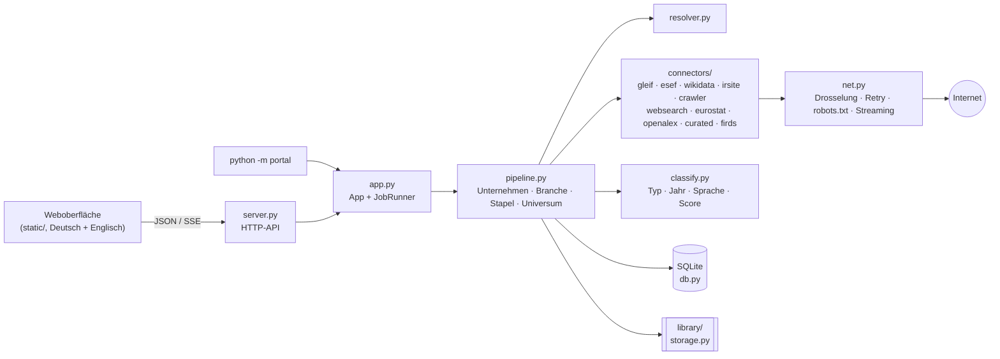

# Plan: EU-Report-Portal

**Ziel:** Für jedes börsennotierte Unternehmen in der EU (und im EWR) per Knopfdruck die **Geschäftsberichte der letzten 10 Jahre** laden und dazu ein **Branchenpaket** zusammenstellen: amtliche Statistik, Studien, Verbandsberichte und die Berichte der Wettbewerber.

Dieses Dokument beschreibt, wie das Portal funktioniert, warum es so gebaut ist und wie es weiterentwickelt wird. Die Implementierung liegt in [`portal/`](../portal), die Bedienung steht in [`portal/README.md`](../portal/README.md).

> **Stand:** Phase 1 und der Kern von Phase 2 (Kennzahlen, Wettbewerbervergleich, Volltextsuche, Übersicht, automatische Aktualisierung) sind implementiert und gegen ein nachgebautes Internet getestet (54 automatische Tests, davon ein Krones-Szenario mit den echten Krones-Zahlen). Die echten Datenquellen waren aus der Entwicklungsumgebung nicht erreichbar, weil die Netzwerk-Policy sie gesperrt hat. Die Konnektoren folgen den dokumentierten API-Formaten und prüfen jede Antwort defensiv. Der erste Lauf gegen die echten Quellen ist trotzdem ein eigener Prüfschritt (siehe [§13](#13-risiken-und-gegenmaßnahmen)).

---

## 1. Umfang: was „alle EU-Aktien“, „10 Jahre“ und „Branchenreports“ konkret heißt

| Anforderung | Umsetzung | Grenze |
|---|---|---|
| **Alle EU-Aktien** | Jede Aktie (CFI-Code `ES…`/`EP…`) mit EU- oder EWR-ISIN, die an einem EU-Handelsplatz zugelassen ist (ESMA FIRDS), dazu alle Emittenten mit ESEF-Berichten. Suche über Name, ISIN oder LEI. | Nur Emittenten mit LEI. Das ist seit MiFID II für zugelassene Emittenten Pflicht. |
| **Letzte 10 Geschäftsberichte** | Die 10 jüngsten abgeschlossenen Geschäftsjahre. Bei abweichendem Geschäftsjahr zählt das Endjahr, z. B. „2023/24“ als 2024. Je Jahr gibt es den gestalteten PDF-Bericht und, ab 2020, zusätzlich den amtlichen ESEF-Bericht. | Vor 2020 gibt es kein ESEF. Diese Jahre hängen vom IR-Archiv des Unternehmens ab, notfalls von der Websuche oder manuellen Links. |
| **Branchenreports** | Branchenpaket je NACE-Code mit 5 Quellenarten: Eurostat, Open-Access-Studien, Verbände und Behörden, Wettbewerber-Berichte, optional Websuche. | **„Alle“ Branchenreports gibt es nicht frei.** Kommerzielle Studien (Statista, IBISWorld, Gartner …) stehen hinter Bezahlschranken und werden nicht umgangen. Sie lassen sich später über eigene Lizenz-APIs anbinden ([§14](#14-roadmap)). |
| **Download** | Jede Datei landet lokal in `library/`, mit SHA-256, Quelle und Abrufdatum im `manifest.json`. Ein ZIP-Export ist je Unternehmen und je Branche möglich. | Die Dateien sind für die eigene Recherche gedacht und werden nicht weiterverbreitet. |

**Nicht-Ziele:** kein Umgehen von Logins, Captchas oder Bezahlschranken, keine Anlageberatung.

---

## 2. Datenquellen-Strategie

Der Grundsatz: **amtliche, maschinenlesbare Quellen zuerst, die Website des Unternehmens als zweite Wahl, Suche nur für Lücken.** Jede Quelle ist ein austauschbarer Konnektor in `portal/connectors/`.

### 2.1 Wer ist das Unternehmen? (Stammdaten und Universum)

| Quelle | Liefert | Zugang | Konnektor |
|---|---|---|---|
| **GLEIF** (api.gleif.org) | LEI, amtlicher Name, Sitzland, ISIN↔LEI-Zuordnung, unscharfe Namenssuche | frei, JSON:API, 60 Anfragen/min | `gleif.py` |
| **ESMA FIRDS** (FULINS_E, wöchentlich) | jede an einem EU-Handelsplatz zugelassene Aktie mit ISIN, Emittenten-LEI, CFI, Handelsplatz und „vom Emittenten beantragt“ | frei, ZIP mit ISO-20022-XML, mehrere hundert MB | `firds.py` |
| **filings.xbrl.org** | Liste aller ESEF-Emittenten, schneller Einstieg ins Universum | frei, JSON:API | `esef.py` |
| **Wikidata** (SPARQL) | offizielle Website, Branche und börsennotierte Unternehmen derselben Branche (Wettbewerber) | frei, gedrosselt | `wikidata.py` |

### 2.2 Geschäftsberichte (10 Jahre)

| Priorität | Quelle | Zeitraum | Format | Warum |
|---|---|---|---|---|
| 1 | **ESEF über filings.xbrl.org** | ab GJ 2020 (in manchen Mitgliedstaaten ab 2021) | XHTML mit Inline-XBRL, ZIP-Paket, optional xBRL-JSON | Amtlicher, rechtlich maßgeblicher Jahresfinanzbericht, maschinenlesbar, eindeutig per LEI zuordenbar |
| 2 | **IR-Website des Unternehmens** | meist 5–15 Jahre Archiv | PDF | Einzige breite Quelle für 2016–2019 und für die gestaltete PDF-Fassung |
| 3 | **Websuche** (Brave Search API oder eigenes SearXNG) | Lücken | PDF | Findet Archive, die der Crawler nicht erreicht. Treffer werden nur von der Unternehmensdomain oder bekannten IR-Hostern (EQS, Cision, Q4 …) akzeptiert |
| 4 | **Manuelle Links** | beliebig | PDF, XHTML | Letzte Lücken; Format `2017: https://…` |
| Roadmap | **OAMs**, die nationalen Speichersysteme (z. B. Unternehmensregister, info-financiere.fr, AFM, CONSOB, CNMV) | 10+ Jahre | PDF | Nur dort anbinden, wo die Nutzungsbedingungen maschinellen Abruf erlauben |
| Roadmap | **ESAP** (European Single Access Point) | laut ESAP-Verordnung schrittweise ab 2027 | zentral, API | Wird langfristig Quelle 1 für alle EU-Pflichtveröffentlichungen |

### 2.3 Branchenreports

| Baustein | Quelle | Inhalt |
|---|---|---|
| Amtliche Statistik | **Eurostat** (JSON-stat-API), gefiltert nach NACE-Code, EU-27 und Heimatland | Produktion, Erzeugerpreise, Unternehmensstatistik (Umsatz, Beschäftigte, Wertschöpfung) über 10 Jahre, als CSV plus Rohdaten |
| Studien | **OpenAlex** | Open-Access-Reports und -Studien zum Branchenthema, nur mit freiem PDF, Lizenz wird gespeichert |
| Verbände und Behörden | kuratierte Startliste je NACE-Abteilung ([`industry_sources.json`](../portal/data/industry_sources.json)) plus eigene Quellen aus der Oberfläche | „Zahlen und Fakten“, Branchen- und Marktberichte, Konjunkturumfragen |
| Wettbewerber | Peers über Wikidata-Branche, gleichen NACE-Code oder manuelle Eingabe, jeweils **deren ESEF-Berichte** | Die Geschäftsberichte der Konkurrenz: oft die beste Branchenanalyse |
| Websuche (optional) | Brave oder SearXNG | frei verfügbare Branchenreports als PDF |

---

## 3. Architektur



| Baustein | Datei | Aufgabe |
|---|---|---|
| HTTP-Client | `net.py` | eigene Drosselung je Host (Standard 1 s, je Quelle konfigurierbar), `Crawl-delay`, Wiederholung mit exponentiellem Backoff und `Retry-After`, robots.txt-Prüfung, Streaming-Downloads mit Größenlimit, SHA-256 und Typprüfung über Magic Bytes (`%PDF`, `PK`, XHTML) |
| Klassifikator | `classify.py` | erkennt Dokumenttyp, Geschäftsjahr und Sprache aus Linktext, Dateiname und Umfeld, in 22 EU-Amtssprachen plus Norwegisch und Isländisch (irische und maltesische Emittenten berichten auf Englisch) |
| Crawler | `connectors/crawler.py` | höflicher Prioritäts-Crawler: bleibt auf der Domain, folgt nur relevanten Links, liest Sitemaps, hält ein Seitenlimit ein und merkt sich den Kontext jedes Links |
| Kennzahlen | `financials.py` | liest Inline-XBRL aus ESEF-Berichten (auch aus dem ZIP-Paket), wendet die ixt-Zahlenformate an, berechnet Kennzahlen und Vergleiche |
| Volltext | `fulltext.py` | FTS5-Index über alle Berichte: ESEF-XHTML immer, PDFs seitengenau mit `pdftotext` |
| Pipelines | `pipeline.py` | Ablauf je Auftragstyp, Auswahl der besten Quelle, Downloads mit Ersatzkandidaten, Abdeckungsmatrix, Manifest |
| Job-Runner | `app.py` | Warteschlange in SQLite, Worker-Threads, Abbrechen, Wiederaufnahme nach Neustart, Live-Protokoll |
| Katalog | `db.py` | Unternehmen (mit FTS5-Volltextsuche), Wertpapiere, Dokumente, Aufträge, Ereignisse, Einstellungen |
| Ablage | `storage.py` | Ordnerstruktur, `manifest.json`, ZIP-Export |
| Server | `server.py` | JSON-API, Server-Sent Events für Live-Fortschritt, Dokumentenanzeige, Sicherheitsprüfungen |
| Excel-Export | `xlsx.py` | schreibt echte `.xlsx`-Dateien (Office Open XML) mit Zahlenformaten und fixierter Kopfzeile, ohne Zusatzpaket |
| Quellen-Check | `diagnostics.py` | prüft parallel, ob GLEIF, filings.xbrl.org, Wikidata, Eurostat, OpenAlex, ESMA und die Websuche erreichbar sind |
| Oberfläche | `static/js/`, `static/i18n/` | ES-Module ohne Build-Schritt: Router, eine Datei je Seite, Hilfe mit Glossar, Diagramme als SVG, alle Texte in `de.json` und `en.json` |

**Technikwahl:** reine Python-Standardbibliothek (3.11+), wie das bestehende `charts/build_charts.py`. Es gibt keine Abhängigkeiten und nichts zu installieren; das Portal läuft auf jedem Rechner mit Python. SQLite genügt für Millionen von Dokumentzeilen; die Dateien selbst liegen im Dateisystem.

---

## 4. Ablauf eines Unternehmensauftrags

1. **Auflösen.** Die Eingabe (Name, ISIN oder LEI) wird über Prüfziffern erkannt (ISIN: Luhn, LEI: ISO 7064 Mod 97-10). ISIN und LEI werden über GLEIF direkt aufgelöst, Namen über den lokalen Katalog (FTS5) und die unscharfe GLEIF-Suche. Börsennotierte und ESEF-Emittenten werden bevorzugt, Tochtergesellschaften nach hinten gestellt. Bei mehreren Treffern steht die Wahl im Protokoll.
2. **Anreichern.** Die ISINs kommen von GLEIF, die Website und die Branche von Wikidata (per LEI oder ISIN). Eine in der Oberfläche eingetragene IR-URL hat immer Vorrang.
3. **ESEF.** Alle Filings des LEI werden geholt, und jedes zurückgegebene Filing wird **clientseitig gegen den LEI geprüft**. Ignoriert der Server den Filter, wird sofort abgebrochen; lehnt er ihn ab, läuft die Abfrage über den Entitäts-Endpunkt. Gibt es je Periode mehrere Einreichungen, gewinnt die jüngste (Korrekturen).
4. **IR-Website.** Der Crawler startet bei der IR-URL oder Website und liest vorher die Sitemaps. Übliche IR-Pfade (`/investor-relations`, `/investoren` …) probiert er mit niedriger Priorität. Er folgt nur Links mit IR-Signalwörtern, maximal 120 Seiten und 3 Ebenen tief. Karriere-, Shop- und Datenschutzseiten werden abgewertet. PDFs auf fremden Hosts (CDNs) werden geladen, aber nicht gecrawlt.
5. **Lücken schließen.** Für Jahre ohne PDF sucht die Websuche, falls eingerichtet. Jahre ganz ohne Dokument kommen zuerst, also meist die Jahre vor ESEF. Manuelle Links werden immer übernommen.
6. **Auswählen.** Je Geschäftsjahr gibt es ein ESEF-Filing (Bericht und Paket) und den besten PDF-Kandidaten, optional einen je Sprache. Die Zweit- und Drittbesten werden als **Ersatzkandidaten** gemerkt.
7. **Laden und prüfen.** Die Downloads laufen parallel, bleiben aber je Host gedrosselt. Jede Datei wird gestreamt und über Magic Bytes geprüft. Liefert ein „PDF“-Link in Wahrheit eine HTML-Fehlerseite, wird verworfen und automatisch der Ersatzkandidat geladen. Doppelte Inhalte (gleiche SHA-256) werden nur einmal gespeichert.
8. **Abdeckung und Manifest.** Die Matrix *Jahr × {PDF, ESEF}* zeigt die fehlenden Jahre mit konkreten Hinweisen. `manifest.json` enthält für jede Datei Quelle, Hash und Abrufzeit.
9. **Branchenpaket** (optional). Es wird mit dem NACE-Code des Unternehmens angestoßen ([§6](#6-branchenpaket)).

Jeder Schritt ist **idempotent**: Bereits vorhandene Dokumente (gleiche URL oder gleicher Hash) werden übersprungen. Ein erneuter Lauf füllt nur Lücken und holt neue Jahre nach.

---

## 5. Erkennung und Auswahl der richtigen Datei

Auf einer IR-Seite stehen neben dem Geschäftsbericht viele ähnliche PDFs: Halbjahresberichte, Nachhaltigkeitsberichte, Vergütungsberichte, Präsentationen, HV-Einladungen und Kurzfassungen. Die Erkennung arbeitet in drei Stufen.

**1. Dokumenttyp.** Bewertet werden zuerst Linktext, `title`-Attribut und Dateiname, und zwar nach Entfernen von Akzenten und Trennzeichen. Nur wenn diese nichts hergeben („PDF (4 MB)“), zählt das Umfeld: Tabellenzeile und Überschrift.

| Stärke | Beispiele (Auszug) |
|---|---|
| eindeutig | Geschäftsbericht, Jahresfinanzbericht, Annual Report, Integrated Report, Universal Registration Document, Rapport annuel, Jaarverslag, Relazione finanziaria annuale, Informe anual, Relatório e contas, Årsredovisning, Årsrapport, Vuosikertomus, Raport roczny, Výroční zpráva, Éves jelentés, Raport anual, Годишен доклад, Ετήσια οικονομική έκθεση, Letno poročilo, Godišnje izvješće, Metinis pranešimas, Gada pārskats, Aastaaruanne |
| wahrscheinlich | Konzernabschluss, Financial Statements, Comptes consolidés, Jaarrekening, Cuentas anuales, Dateikürzel wie `GB2019.pdf`, `AR19_EN.pdf`, `URD-2021.pdf` |
| schließt aus | Halbjahr/Quartal/interim/semestriel/H1/Q3 …, Vergütung/remuneration, Hauptversammlung/AGM/Einladung, Präsentation/Slides, Pressemitteilung |
| eigener Typ | Nachhaltigkeitsbericht (optional ladbar), Jahresabschluss der Einzelgesellschaft (nur als Ersatz, wenn der Konzernbericht fehlt) |

Die Ausschlüsse haben Vorrang, weil Wortteile täuschen: „Halb**jahresfinanzbericht**“ enthält „Jahresfinanzbericht“, und „Informe **anual** de remuneraciones“ ist ein Vergütungsbericht. Kombinierte Titel wie „Års- och hållbarhetsredovisning“ gelten dagegen als Geschäftsbericht.

**2. Geschäftsjahr.** Jahreszahlen werden gewichtet nach Fundort: Linktext 5, Dateiname 4, die nächstgelegene Zahl davor 3, Überschrift 2, Verzeichnispfad 1. Spannen wie „2023/24“ ergeben das Endjahr mit Label „2023/24“. Datumsangaben wie `/uploads/2021/03/` oder `15.03.2021` gelten als Veröffentlichungsdatum und werden stark abgewertet.

**3. Sprache und Rangfolge.** Die Sprache ergibt sich in dieser Reihenfolge aus einem ausgeschriebenen Wort („English“), einem Kürzel am Anfang oder Ende des Dateinamens (`_EN`), einem Kürzel in Klammern im Linktext („(EN)“), der Sprache des Begriffs, dem Verzeichnis (`/de/`) und schließlich der Seitensprache. Der Score kombiniert:

```
Score = Typstärke (60/40/20) + Jahres-Evidenz (bis 22) + Sprachpräferenz (12/7/2)
        − 30 Kurzfassung − 15 Kapitel-PDF + 5 „vollständig“ − 5 nur aus dem Umfeld
```

Die Sprachpräferenz ist einstellbar. Standard ist Englisch, sonst die Landessprache. Die Option „beide“ lädt je Jahr beide Sprachfassungen.

---

## 6. Branchenpaket

1. **NACE-Code festlegen.** Er wird im Portal gewählt (88 Abteilungen, Deutsch/Englisch) oder genauer eingetippt, z. B. `28.29`. Er wird je Unternehmen gespeichert. Eine automatische Vorschlagsfunktion aus Wikidata-Branche und ESEF-Tätigkeitsbeschreibung ist für Phase 2 vorgesehen.
2. **Eurostat.** Konfigurierte Datensätze ([`eurostat_datasets.json`](../portal/data/eurostat_datasets.json)) werden abgefragt, je nach NACE-Abschnitt: Produktion und Erzeugerpreise für die Industrie, Unternehmensstatistik bis 2020 und ab 2021. Filter sind NACE, EU-27 plus Heimatland und die letzten 10 Jahre. Das Ergebnis wird als flache CSV (mit Codes und Klartext) plus JSON-Rohdaten gespeichert. Hinweis: Griechenland heißt bei Eurostat `EL`. Eurostat stellt schrittweise auf NACE Rev. 2.1 um, deshalb liegen die Datensatz-Codes in einer Konfigurationsdatei statt im Code.
3. **OpenAlex.** Gesucht wird nach Stichwörtern oder dem Branchennamen, nur Open Access mit PDF, ab Beginn des Zeitraums, Typ `report|article`.
4. **Verbände und Behörden.** Die Startliste je NACE-Abteilung umfasst z. B. VDMA/Orgalim für Maschinenbau, ACEA/VDA für Automobil, Cefic/VCI für Chemie und EFPIA für Pharma, dazu branchenübergreifend EU-Kommission, OECD und EIB. Eigene Quellen kommen über die Oberfläche hinzu. Der Crawler sucht Publikationsseiten (Tiefe 2), und jedes PDF wird nach Branchenrelevanz bewertet: positiv sind „Zahlen und Fakten“, Branchenbericht, Marktausblick, Statistik und Konjunktur plus Treffer bei den Stichwörtern; negativ sind Einladung, Satzung, Pressemitteilung und Jahre vor dem Zeitraum. Es werden höchstens N PDFs je Quelle geladen.
5. **Wettbewerber.** Quellen sind manuelle Eingaben, dieselbe Wikidata-Branche (nur EU/EWR, nur mit LEI und ISIN) und derselbe NACE-Code im Katalog. Geladen wird jeweils der jüngste ESEF-Bericht, einstellbar auch mehrere Jahre.

Die Ablage erfolgt unter `library/industries/nace-28/{statistics,studies,associations,peers/<firma>,web}/`, mit eigenem Manifest und ZIP-Export.

---

## 7. Auswertung: Kennzahlen, Vergleich, Volltext

**Kennzahlen aus ESEF.** Jeder ESEF-Bericht enthält die Zahlen der Pflichtabschlüsse als Inline-XBRL-Fakten nach IFRS-Taxonomie, jeweils mit Vorjahreswerten. Das Portal liest nach jedem Abruf automatisch:

| Grundwerte (IFRS-Konzept) | abgeleitet |
|---|---|
| Umsatz (`Revenue`, sonst `RevenueFromContractsWithCustomers`), Bruttoergebnis, EBIT (`ProfitLossFromOperatingActivities`), Ergebnis vor Steuern, Jahresergebnis gesamt und Aktionärsanteil, Ergebnis je Aktie, Abschreibungen, operativer Cashflow, Investitionen in Sach- und immaterielle Anlagen, gezahlte Dividenden, Bilanzsumme, Eigenkapital, Zahlungsmittel, Schulden | Umsatzwachstum, EBIT-Marge, Nettomarge, Free Cashflow (operativer Cashflow minus Investitionen) und FCF-Marge, Eigenkapitalquote, Eigenkapitalrendite (auf das durchschnittliche Eigenkapital) |

Die Regeln dahinter:
- Nur Fakten **ohne Dimension** zählen, also Konzernwerte und keine Segmentzahlen.
- Periodenwerte müssen ein ganzes Geschäftsjahr umfassen (300–380 Tage).
- Die Zahlenformate (`num-dot-decimal`, `num-comma-decimal`, `fixed-zero`, Skalierung, `sign="-"`) werden korrekt umgerechnet.
- Es gilt der **ursprünglich berichtete** Wert. Weicht der Vorjahreswert im Folgebericht ab, erscheint er als Restatement-Hinweis.

Sechs ESEF-Berichte ergeben so sieben Jahre Zahlenreihe. Oben stehen Kacheln mit dem Wichtigsten (Umsatz mit Veränderung zum Vorjahr, durchschnittliches Wachstum, Marge, Ergebnis je Aktie), darunter vier Diagramme: Umsatz; EBIT-Marge, sonst Nettomarge; Free Cashflow, sonst Ergebnis je Aktie; Eigenkapitalquote, sonst Umsatzwachstum – je nachdem, was die Berichte hergeben. Alle Werte gibt es als Tabelle, als **Excel-Datei** (`.xlsx` mit den Blättern Kennzahlen, Dokumente, Info) und als CSV (Semikolon, Dezimalkomma, UTF-8 mit BOM).

**Unternehmensvergleich.** Bis zu vier Unternehmen – eigene und Wettbewerber aus Branchenpaketen – als Linien über die Jahre, wahlweise absolut oder indexiert (erstes gemeinsames Jahr = 100). Bei unterschiedlichen Währungen werden Beträge automatisch indexiert. Dazu eine Momentaufnahme des letzten Geschäftsjahres mit Median und ein Excel-Export (ein Blatt je Kennzahl). Die Auswahl steht in der Adresse (`#/compare?leis=…`) und lässt sich als Link weitergeben. Auf der Unternehmensseite öffnet „Mit Wettbewerbern vergleichen“ den Vergleich mit den Wettbewerbern aus dem Branchenpaket.

**Wettbewerbervergleich.** Aus den ESEF-Berichten der Wettbewerber im Branchenpaket entsteht je Unternehmen das letzte Geschäftsjahr mit Wachstum, Margen, Eigenkapitalquote und ROE, dazu der Median. Das gewählte Unternehmen ist hervorgehoben (Akzentfarbe, die anderen grau). Verhältniszahlen sind über Währungen hinweg vergleichbar; absolute Beträge tragen ihre Währung.

**Volltextsuche.** Alle Berichte landen in einem SQLite-FTS5-Index (ohne Akzente, damit „Zolle“ auch „Zölle“ findet). Mehrere Wörter werden UND-verknüpft; „Phrase“, Wortanfang\* und OR sind möglich. Filtern lässt sich nach Unternehmen und Jahren. Treffer zeigen einen markierten Textausschnitt und führen bei PDFs direkt auf die Seite. ESEF-XHTML ist immer durchsuchbar; PDFs werden seitenweise indiziert, sobald `pdftotext` (poppler-utils) installiert ist. `python -m portal index` holt das nach.

**Übersicht und Pflege.**
- Die Startseite zeigt Bestand, Speicher, zuletzt geladene Dokumente, Unternehmen mit Lücken, laufende Aufträge und die Beobachtungsliste.
- In der Jahresübersicht nimmt „+ Link“ bei einem fehlenden Jahr direkt die Adresse einer PDF-Datei an.
- ✕ („Falsch“) löscht ein Dokument und sperrt dessen Link. Beim nächsten Lauf kommt der Ersatzkandidat zum Zug.
- Mit `auto_refresh_days` holt der Server die Beobachtungsliste selbstständig nach, z. B. alle 7 Tage.
- Notizen je Unternehmen werden automatisch in der Datenbank gespeichert.

**Bedienung.** Die Oberfläche soll ohne Vorwissen verständlich sein:
- **Geführter Einstieg.** Die Startseite erklärt den Ablauf in drei Schritten und zeigt eine Einrichtungs-Checkliste (Kontakt-E-Mail, optional Websuche und `pdftotext`). „Datenquellen prüfen“ zeigt in Sekunden, ob Firewall oder Proxy eine Quelle blockieren.
- **Hilfe überall.** Jeder Fachbegriff (ESEF, LEI, ISIN, NACE, Abdeckung, Branchenpaket …) hat ein „?“, das die Hilfe beim passenden Glossareintrag öffnet. Die Hilfe enthält außerdem eine Anleitung und häufige Fragen („Warum fehlen Jahre?“).
- **Ein Knopf.** Auf der Unternehmensseite genügt „Jahresberichte laden“; Jahre, Sprache, ESEF-Formate, Quellen und eigene Links liegen eingeklappt unter „Weitere Optionen“. Fehlt für das Branchenpaket die Branche, sagt das Feld selbst, was zu tun ist.
- **Fortschritt als Checkliste.** Statt eines Protokolls sieht man die Schritte (Unternehmen bestimmen, ESEF suchen, PDF suchen, Websuche, Auswahl, Download, Auswertung, Branchenpaket) mit Status, Begründung für übersprungene Schritte und Warnungen. Am Ende steht eine Zusammenfassung („10 von 10 Jahren“, neue Dateien, Kennzahlen, fehlende Jahre) mit den nächsten Schritten. Das ausführliche Protokoll bleibt aufklappbar.
- **Jahresübersicht** mit einer Karte je Geschäftsjahr: PDF und ESEF, Sprache, Vorschau im Portal, Download, ✕ für falsche Dateien, „+ Link“ für Lücken.
- **Vorschau** von PDF und ESEF-Bericht in einem Fenster, bei Volltext-Treffern direkt auf der Fundstelle.
- **Deutsch/Englisch** und **hell/dunkel/System** umschaltbar (gilt nur im jeweiligen Browser), Druckansicht für einen Unternehmensbericht, Handy-tauglich, Tastatur: `/` springt ins Suchfeld.

---

## 8. Massenbetrieb: alle EU-Aktien

**Universum aufbauen.** Es gibt 2 Wege, beide über die Oberfläche (Reiter *Universum*) oder `python -m portal universe`:

- `--source esef`: alle ESEF-Emittenten von filings.xbrl.org. Das geht in Minuten und deckt praktisch alle Emittenten an regulierten Märkten ab.
- `--source firds`: die komplette ESMA-Referenzdatenbank. Sie wird als Stream geparst (konstanter Speicherbedarf), auf Aktien mit EU/EWR-ISIN gefiltert und je ISIN über alle Handelsplätze zusammengeführt. Delistete Titel werden markiert. Neue Emittenten bekommen ihren Namen gebündelt von GLEIF (100 LEIs je Anfrage). Das erfasst auch Wachstumssegmente (MTF), die kein ESEF liefern müssen.

**Stapelabruf.** Man wählt Länder, „nur mit ESEF“ und eine Höchstzahl. Für jedes Unternehmen wird ein eigener Auftrag eingereiht, der einzeln abbrechbar ist und nach einem Neustart fortgesetzt wird. Ab 500 Unternehmen ist eine ausdrückliche Bestätigung nötig.

**Kapazität (grobe Schätzung, 3.000 Emittenten):**

| Posten | Rechnung | Ergebnis |
|---|---|---|
| ESEF-Dateien | 3.000 × 6 Jahre × 2 Dateien bei 1 Anfrage/s auf filings.xbrl.org | ca. 10 Stunden |
| IR-Crawling und PDFs | 3.000 × ca. 60–130 Anfragen, je Website gedrosselt, 2 parallele Aufträge | ca. 1–2 Tage |
| Speicher | je Unternehmen ca. 10 PDFs × 8 MB + 6 × 20 MB ESEF ≈ 200 MB | ca. 0,6 TB |

Empfehlung: Beim Massenabruf zuerst **nur ESEF-Berichte (XHTML)** laden und die PDFs gezielt für die Beobachtungsliste. Die Stapel sollten nachts laufen.

**Aktuell halten.** Unternehmen werden in der Oberfläche mit ★ markiert, dann holt `python -m portal refresh` (per cron, z. B. wöchentlich) neue Jahre nach. Das Universum sollte einmal pro Woche aktualisiert werden, weil FIRDS wöchentlich neue Volldateien veröffentlicht.

---

## 9. Datenmodell und Ablage

| Tabelle | Inhalt |
|---|---|
| `companies` | LEI (Schlüssel), Name, Land, ISINs, Website, IR-URL, NACE, Stichwörter, Wikidata-Branchen, Flags *börsennotiert*/*ESEF*/*beobachtet*; FTS5-Index für die Namenssuche |
| `securities` | ISIN, LEI, CFI, Währung, Handelsplatz, „vom Emittenten beantragt“, Erst-/Endhandelstag (aus FIRDS) |
| `documents` | Bereich (Unternehmen/Branche), LEI/NACE, Kategorie, Geschäftsjahr und Label, Sprache, Quelle, Quell-URL, Pfad, SHA-256, Größe, Typ, Score, Metadaten; eindeutig je (Bereich, URL, LEI, NACE) |
| `jobs`, `job_events` | Aufträge mit Status, Fortschritt, Ergebnis sowie lückenloses Protokoll (auch für die Live-Anzeige) |
| `financials` | Kennzahl je Unternehmen, Geschäftsjahr und Metrik, mit IFRS-Konzept, Quelldokument und ggf. Restatement |
| `doc_text`, `doc_index` | FTS5-Volltextindex (Textblöcke mit Seitenzahl) und Indizierungsstatus je Dokument |
| `blocked_urls` | als falsch markierte Links, die künftig übersprungen werden |
| `industry_sources`, `settings` | eigene Branchenquellen, in der Oberfläche geänderte Einstellungen, Planer-Zustand |

```
library/
  companies/DE/krones-ag_<LEI>/2019/annual_report_2019_en.pdf
                              /2024/esef_report_2024.xhtml, esef_package_2024.zip
                              manifest.json
  industries/nace-28/statistics/eurostat_sts_inpr_a.csv (+ .json)
                    /studies/  /associations/  /peers/<firma>_<LEI>/  /web/
                    manifest.json
  exports/<name>.zip
  portal.sqlite3
```

---

## 10. Fair Use, Recht und Sicherheit

- **robots.txt wird immer beachtet**, auch `Crawl-delay`. Bei Serverfehlern auf robots.txt wird nicht gecrawlt. Offizielle API-Downloads (ESEF, Eurostat) sind davon ausgenommen, weil sie für den maschinellen Abruf gedacht sind.
- **Drosselung je Host** (Standard 1 Anfrage/s; GLEIF 1/s, Wikidata 1/2 s, OpenAlex 5/s), Backoff bei 429/503 und `Retry-After`. Eine Proxy-Ablehnung wird nicht wiederholt.
- **Identifikation:** Der User-Agent nennt Tool und Kontaktadresse. Wikidata und OpenAlex verlangen das; die Adresse wird in den Einstellungen gesetzt.
- **Keine Umgehung** von Bezahlschranken, Logins oder Captchas. Kommerzielle Datenbanken nur mit eigener Lizenz und offizieller API.
- **Urheberrecht:** Die Dokumente sind für die eigene Analyse bestimmt. Die Bibliothek bleibt lokal, und das Manifest belegt die Herkunft jeder Datei.
- **Portal-Sicherheit:** Standardmäßig lauscht es nur auf `127.0.0.1`. Andere Adressen gehen nur mit Zugriffstoken. Die Host-Prüfung schützt gegen DNS-Rebinding. Schreibende Anfragen müssen JSON sein und aus derselben Herkunft stammen (CSRF-Schutz). Die Oberfläche hat eine strikte Content-Security-Policy. XHTML-Dokumente werden mit `CSP: sandbox` ausgeliefert, damit eingebettete Skripte nicht laufen. Pfade werden gegen Traversal geprüft. Geheime Schlüssel erscheinen in der Oberfläche nur maskiert.

---

## 11. Qualitätssicherung

- **Nachgebautes Internet** ([`tests/fakeweb.py`](../tests/fakeweb.py)): GLEIF, filings.xbrl.org, Wikidata, Eurostat, OpenAlex, ESMA FIRDS, Brave, ein Branchenverband und eine Unternehmenswebsite. Die Website hat 10 Berichtsjahre in DE/EN, ein Archiv mit Links ohne aussagekräftigen Text, ein PDF nur in der Sitemap, ein PDF auf einem CDN, einen defekten Link, robots-gesperrte Bereiche und Störer (Halbjahres-, Nachhaltigkeits-, Vergütungsbericht, Präsentation, Kurzfassung, HV-Einladung).
- **62 Tests** (`python3 -m unittest discover -s tests -t .`):
  - 10/10 Jahre in der richtigen Sprache, die Kurzfassung verliert, der Ersatz springt bei einem defekten Link ein
  - robots.txt wird nie verletzt
  - Hashes und Manifest stimmen, ein zweiter Lauf lädt nichts doppelt
  - ESEF-Server, die den Filter ignorieren oder ablehnen
  - Websuche schließt eine Lücke, und nicht vertrauenswürdige Treffer werden verworfen
  - Branchenpaket mit genau den erwarteten Dateien
  - Universum aus ESEF und FIRDS, Stapel
  - HTTP-API, Live-Stream, ZIP-Export sowie Sicherheitsprüfungen (Host, Herkunft, JSON-Pflicht, Traversal, Token, maskierte Schlüssel)
  - Notizen, Quellen-Check, Vergleich und beide Excel-Exporte (gültige `.xlsx`-Dateien mit den richtigen Blättern)
  - Checkliste: Schritte in der richtigen Reihenfolge, das Branchenpaket im Unternehmensauftrag meldet Unterschritte
  - Oberflächentexte: jeder verwendete Schlüssel existiert auf Deutsch und Englisch, mit denselben Platzhaltern
  - Klassifikation mit Beispielen in 10 Sprachen
  - Kennzahlen aus Inline-XBRL: deutsches und englisches Zahlenformat, Vorzeichen, Nullstrich, Vorjahreswerte, Restatement, Segmentwerte ausgeschlossen, Ersatz durch das ZIP-Paket
  - Volltextsuche inkl. PDF-Seiten mit einem nachgebildeten `pdftotext`, Wettbewerbervergleich, Ersatz eines als falsch markierten Dokuments, automatische Aktualisierung
  - **Krones-Szenario** ([`tests/krones_scenario.py`](../tests/krones_scenario.py)): jede Funktion mit Krones AG (ISIN DE0006335003) und den Krones-Zahlen aus `data/krones_financials_2015_2025.csv`. Das Portal muss Umsatz, EBT, Jahresergebnis und EPS 2019–2025 exakt wiedergeben, inklusive Verlustjahr 2020, −16,1 % Umsatz 2020 und +70 % bis 2025. Die Quellen sind nachgebildet; die LEI ist ein Platzhalter.
- **Oberfläche** mit Headless-Chromium im Krones-Szenario durchgespielt: Einrichtung und Quellen-Check, Suche per Tastatur, Laden mit Checkliste, Jahresübersicht, Vorschau, Kennzahlen und Excel, Notizen, falsche Datei ersetzen, Beobachten, Stammdaten, Vergleich mit Wettbewerbern, Branchenpaket, Volltext, Bibliothek, Aufträge, Hilfe, Englisch und dunkel, Druckansicht, Handy-Breite ohne horizontales Scrollen, keine Konsolenfehler.
- **Kennzahlen im Betrieb:** Abdeckungsquote (Jahre mit Bericht ÷ Zieljahre) je Unternehmen und Land, Anteil Ersatzkandidaten, Fehlerquote je Quelle, robots-Blockaden. Das alles lässt sich aus `documents` und `job_events` ablesen.

---

## 12. Betrieb

```bash
python3 -m portal serve --open            # Oberfläche auf http://localhost:8765
python3 -m portal fetch DE0006335003 --industry --nace 28   # z. B. Krones, per Kommandozeile
python3 -m portal universe --source esef  # Katalog aller ESEF-Emittenten
python3 -m portal batch --country DE,AT --esef-only --limit 50
python3 -m portal refresh                 # Beobachtungsliste (für cron)
python3 -m portal figures DE0006335003    # Kennzahlen als Tabelle (--csv de für Excel)
python3 -m portal grep "Zoll*" --limit 10 # Volltextsuche
python3 -m portal index                   # Volltext nachindizieren, Kennzahlen neu berechnen
```

Die Konfiguration steht in `portal.toml` (Vorlage: [`portal.example.toml`](../portal.example.toml)) oder in Umgebungsvariablen `PORTAL_<NAME>`. Einige Werte lassen sich direkt in der Oberfläche ändern. Für einen Server-Betrieb: `host = "0.0.0.0"`, `access_token` setzen und das Portal hinter einen Reverse-Proxy mit TLS stellen.

---

## 13. Risiken und Gegenmaßnahmen

| Risiko | Auswirkung | Gegenmaßnahme |
|---|---|---|
| API-Details weichen ab (Filtersyntax, Feldnamen, umbenannte Eurostat-Datensätze) | Quelle liefert nichts | defensive Parser, Fallback-Routen, clientseitige LEI-Prüfung, Datensätze in Konfiguration; **erster Live-Lauf als Abnahmetest** mit 5–10 bekannten Emittenten aus verschiedenen Ländern |
| IR-Seiten rendern Berichtslisten nur per JavaScript | PDFs unsichtbar für den Crawler | Sitemaps, Websuche, manuelle Links; Phase 2: optionaler Headless-Browser |
| Keine Website bekannt (kein Wikidata-Eintrag) | keine PDFs vor 2020 | Hinweis im Protokoll, IR-URL einmal eintragen (wird gespeichert) |
| Falsche Zuordnung (Kurzfassung, Kapitel, falsches Jahr) | falsches Dokument | Score mit Abzügen, Ersatzkandidaten, Anzeige der Quelle, manuelle Korrektur per Link |
| Bot-Schutz, Captcha, 403 | Lücke | wird respektiert und protokolliert, nicht umgangen |
| Speicher und Laufzeit im Massenbetrieb | Platte voll, lange Läufe | Formatwahl (nur XHTML), Stapellimits, Deduplizierung per Hash, Wiederaufnahme |
| Namensmehrdeutigkeit (Tochtergesellschaften) | falsches Unternehmen | ISIN/LEI bevorzugen, börsennotierte zuerst, Alternativen im Protokoll |

---

## 14. Roadmap

| Phase | Inhalt | Status |
|---|---|---|
| **1 – Fundament** | alles in diesem Dokument: Universum, 10-Jahres-Abruf aus ESEF + IR-Website + Websuche + manuell, Branchenpaket, Oberfläche, CLI, Stapel, Tests | **umgesetzt** |
| 1b – Abnahme live | Lauf gegen die echten Quellen mit Stichprobe aus DE, FR, IT, ES, NL, SE, PL; Feinjustierung der Signalwörter und Datensatz-Codes | nächster Schritt |
| 2 – Auswertung | Kennzahlen aus Inline-XBRL mit Diagrammen und CSV, Wettbewerbervergleich, Volltextsuche, Übersicht, automatische Aktualisierung, Lücken schließen und falsche Dokumente ersetzen | **umgesetzt** |
| 2a – Bedienung | geführter Einstieg, Hilfe und Glossar, Checkliste statt Protokoll, Jahresübersicht mit Vorschau, Vergleich von bis zu 4 Unternehmen, Notizen, Excel-Export, Quellen-Check, Deutsch/Englisch, hell/dunkel, Druckansicht | **umgesetzt** |
| 2b – Auswertung | NACE-Vorschlag aus ESEF-Tätigkeitsbeschreibung; Headless-Browser für JavaScript-Seiten; Kennzahlen vor 2019 aus PDF-Tabellen | geplant |
| 3 – Quellen | OAM-Konnektoren, wo zulässig; ESAP, sobald verfügbar; Lizenz-Konnektoren (z. B. Statista-API) mit eigenem Schlüssel; Benachrichtigung bei neuen Berichten | geplant |
| 4 – Team | Mehrbenutzer, gemeinsame Bibliothek auf Server/NAS, Volltextsuche über alle Berichte | optional |

---

## 15. Offene Entscheidungen

1. **Sprachpräferenz** als Standard: Englisch zuerst (heute) oder Landessprache zuerst?
2. **Websuche**: Brave-API-Schlüssel (kostenloser Plan mit Monatslimit) oder eigenes SearXNG?
3. **Massenabruf**: nur beobachtete Unternehmen oder regelmäßig das ganze ESEF-Universum (ca. 0,6 TB)?
4. **Europa-Begriff**: EU + EWR (heute) oder zusätzlich Vereinigtes Königreich und Schweiz (technisch vorbereitet über `universe_countries`)?
